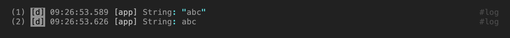

# Team Logger

[](https://pub.dev/packages/team_logger)
[](https://dart.dev)
[](https://flutter.dev)
[](https://opensource.org/licenses/MIT)

A highly-configurable, trace-aware, structured logging library designed for
large teams, complex applications, and high-volume logs in Dart & Flutter.

`team_logger` provides nested namespace loggers, automated zone-based
trace propagation, custom object formatting (`Loggable`), inline BBCode
formatting, and customizable styling themes.

It is built on [`logger_builder`](https://pub.dev/packages/logger_builder)
and re-exports it whole, so the parts that are not about console output —
`MultiPublisher`, `TransformPublisher`, `AsyncPublisher`, `Lazy`, the level
constants — come from there and need no separate import. Where they appear
below, that is where they are from.

---

## Features

* **Color & Dynamic Themes**: Style individual log elements using ANSI escape
  codes, apply ready-made grayscale or RGB palettes, and dynamically shift
  bracket colors based on nesting depth to clarify nested structures.
* **Active vs. Inactive Themes**: Configure active and inactive styling rules
  to keep background logs visible but low-contrast, while emphasizing active
  or high-severity logs.
* **Row-Based Console Layouts**: Configure custom log formats using modular
  row components: sequence numbers, log level names, timestamps, trace IDs,
  tags, namespace paths, and messages.
* **Zone-Based Trace Propagation**: Automatically propagate and associate
  trace IDs across asynchronous execution paths using Dart Zones
  (`log.trace()`), reducing the need to pass context parameters manually.
* **Custom Object Formatting (`Loggable`)**: Mixin `Loggable` on classes to
  specify how properties, unit suffixes, number formats, and collections
  should be formatted inside logs.
* **Type Converters**: Register custom formatting converters for third-party
  classes that do not directly implement `Loggable`.
* **BBCode Console Formatting**: Apply formatting in log messages using
  standard and customizable tags like `[success]...[/success]` or
  `[b]bold[/b]`, which compile to ANSI escape sequences.
* **Namespace Loggers**: Instantiate child loggers via `createChild()` to
  generate structured path hierarchies (e.g. `app/network/polling`).
* **In-Memory Circular Buffer (`LogStorage`)**: Collect a fixed number of
  recent logs in memory for diagnostic exports or in-app inspection.
* **Log Files (`FileLogStorage`)**: Write logs to the device as JSON Lines,
  one session per run, with rotation and retention budgets per chunk, per
  session and across all sessions. Sessions can be listed, read back, and
  streamed into a single gzipped file to send for diagnostics.

---

## Table of contents

- [Quick Start](#quick-start)
- [Deep Dive](#deep-dive)
  - [1. Message Layout](#1-message-layout)
  - [2. Colors & Dynamic Themes](#2-colors--dynamic-themes)
  - [3. Active vs Inactive Modes](#3-active-vs-inactive-modes)
  - [4. BBCode Tags](#4-bbcode-tags)
  - [5. Data Output](#5-data-output)
  - [6. Formatting Complex Objects](#6-formatting-complex-objects)
  - [7. Trace Propagation (`TraceId`)](#7-trace-propagation-traceid)
  - [8. Circular Buffer (`LogStorage`)](#8-circular-buffer-logstorage)
  - [9. Saving Logs to Files (`FileLogStorage`)](#9-saving-logs-to-files-filelogstorage)
  - [10. Redacting Logs (`Logger.transformer` and `Loggable.sanitizer`)](#10-redacting-logs-loggertransformer-and-loggablesanitizer)
  - [11. Untrusted Text and Terminal Output](#11-untrusted-text-and-terminal-output)
  - [12. Writing Your Own Publisher](#12-writing-your-own-publisher)
  - [13. Flutter](#13-flutter)
- [Known Limitations](#known-limitations)
- [License](#license)

---

## Quick Start

Two gates gate every log, and both are shut by default: a logger's `level`
starts at `LogLevels.off`, and until a publisher is attached a log has
nowhere to go. A `Logger` you merely constructed prints nothing and does not
complain about it:

```dart
Logger('app').i('nothing happens'); // no output, no warning
```

The smallest thing that prints:

```dart
final log = Logger('app')
  ..level = LogLevels.all
  ..publisher = ConsoleLogPrinter(
    rows: const [LogRow.singleLine(children: [LogMessage()])],
  );

log.i('hello');
// hello
```

`LogRow` requires a `maxLength` — the width it wraps at. `LogRow.singleLine`
is the variant without one: no width limit, no wrapping, one line per log.
Everything else on this page adds to those five lines.

The following example configures theme, builds a custom console row layout,
creates child loggers, and executes code in a trace zone.

```dart
import 'package:team_logger/team_logger.dart';

// Initialize the logger with a custom layout
final log = Logger('app')
  ..level = LogLevels.all
  ..publisher = ConsoleLogPrinter(
    theme: LogMainTheme.defaultActiveTheme,
    rows: const [
      LogRow(
        maxLength: 120,
        children: [
          LogNum(),
          LogLevelName.short(),
          LogTime.onlyTime(),
          LogPath(),
          LogTraceId(),
          LogMessage(),
        ],
        tail: [
          LogTags(),
        ],
      ),
    ],
  );

Future<void> main() async {
  log.i('App started');

  // Create child loggers
  final paymentLog = log.createChild(name: 'payment');

  // Execute within a Trace Zone to automatically capture and output the TraceId
  await log.trace(TraceId.auto('payment'), () async {
    paymentLog.i('Initiating payment request...');
    await payment(10, 'USD');
    paymentLog.i('Payment processed successfully');
  });
}

Future<void> payment(int amount, String currency) async {
  final networkLog = log.createChild(name: 'network', tags: {'http'});

  networkLog.d(
    'https://api.example.com/[b]v1/payment[/b]',
    tags: ['request'],
    data: {'amount': amount, 'currency': currency},
  );

  // ... api call ...

  networkLog.d(
    '[success][200 OK][/success] https://api.example.com/[b]v1/payment[/b]',
    tags: ['response'],
    data: {'payment_id': 123},
  );
}
```

Output:


When filtering by sequence number **all lines** included in the message will be
displayed:


When filtering by trace ID, all messages sent within `log.trace` scope and
**all lines** within those messages will be displayed:


When filtering by tag, all messages with tag `#http` and
**all lines** within those messages will be displayed:


---

## Deep Dive

### 1. Message Layout

Configuring log output layout is done through the `rows` parameter in the
`ConsoleLogPrinter`. This parameter accepts a list of `LogRow` instances.

`LogRow` consists of two optional lists: `children` and `tail`.
- `children`: Elements that make up the main body of the log message.
- `tail`: Elements that are appended to the main body, typically used for tags.

Both `children` and `tail` accept a list of `LogBlock` instances.
`LogBlock` is the interface of a single log element, such as a sequence
number, log level name, timestamp, trace ID, path, or message.

```dart
import 'package:team_logger/team_logger.dart';

final log = Logger('app')
  ..level = LogLevels.all
  ..publisher = ConsoleLogPrinter(
    rows: const [
      LogRow(
        maxLength: 100,
        children: [
          LogNum(),
          LogLevelName.short(),
          LogTime.onlyTime(),
          LogPath(),
          LogTraceId(),
          LogMessage(),
        ],
        tail: [
          LogTags(),
        ],
      ),
    ],
  );

log.d(
  'User info',
  traceId: TraceId.auto('user'),
  data: {
    'firstName': 'Alex',
    'lastName': 'Brown',
    'age': 30,
    'sex': 'male',
    'children': [
      {'name': 'Mary', 'age': 5},
      {'name': 'Bob', 'age': 2},
    ],
  },
);
```


`LogBlock` has several implementations that can be used to represent
different log elements:
- `LogNum()`: Sequence number of the log message.
- `LogLevelName.full()`: Full name of the log level.
- `LogLevelName.short()`: Short name of the log level.
- `LogTime.dateTime()`: Date and time of the log message.
- `LogTime.iso8601()`: Date and time of the log message in ISO 8601 format.
- `LogTime.onlyTime()`: Time of the log message.
- `LogPath()`: Path of the log message.
- `LogTraceId()`: Trace ID of the log message.
- `LogMessage()`: Message of the log message.
- `LogTags()`: Tags of the log message.

The `maxLength` parameter limits the width of the log message. If the log
message exceeds the `maxLength`, it will be wrapped to the next line.

Width is counted in **terminal columns**, not in characters or UTF-16 code
units: `世` and most emoji take two columns, `e` followed by a combining
accent takes one, and text is never cut inside a grapheme cluster. A cluster
that does not fit the room left moves to the next line whole, so a row may
end up one column short of `maxLength` rather than splitting a glyph in
half.

`LogMessage` takes up all the remaining space in the line. If you need to place
something to the right of `LogMessage`, use the `tail` parameter (as is done
for `LogTags`).

#### Single line

The message can be displayed as a single line (it will be wrapped by the
terminal):

```dart
final log = Logger('app')
  ..level = LogLevels.all
  ..publisher = ConsoleLogPrinter(
    rows: const [
      LogRow.singleLine(
        children: [
          // ...
        ],
      ),
    ],
  );
```


A single-line log is harder to analyze visually, but its advantage is that it
takes up only one line in your IDE’s console buffer. This is important when the
buffer has a line limit (10,000 for VSCode/Antigravity) and there are a lot of
logs. Such lines are also easier to filter: when filtering, the IDE will show
you only those lines containing the text you're looking for, rather than the
entire message if it spans multiple lines.

The same property makes this the layout to choose when an AI agent reads the
logs. One log is one line, so a grep or a filter returns whole records rather
than fragments, and nothing has to be reconstructed from the neighbouring
lines to understand a match. A wrapped message gives the agent the opposite:
a hit on a middle line, with the message it belongs to spread across lines
before and after it.

#### Filter logs

`team_logger` makes it a little easier to search for and filter messages by
duplicating key message information in each line, but it hides this information
so it doesn't interfere with log analysis:

```dart
final theme = LogMainTheme.defaultActiveTheme.copyWith(
  hiddenStyle: Styles.rgb050,
);
```


This way, you'll always be able to filter by sequence number, level, time,
namespace path, trace ID, and tags.

When filtering by message content or data, you still won’t see the full
message. But in this case, once you’ve found the log you’re looking for, you
can always filter by its sequence number. Just remember that even if you can’t
see the sequence number, it’s still there. Highlight it with your mouse and
copy it to the clipboard, and paste it into the filter field.

Some IDEs do not support the ANSI hidden style (Android Studio). In that case,
you may need to adjust the `hiddenStyle` foreground color so that it matches
the background of your IDE's debug console.

#### Why do we need rows?

When a log entry contains a stack trace, by default it is displayed within the
`LogMessage`, directly below the message itself, strictly within the space
allocated for the message:

```dart
void someOperation() {
  try {
    calcResult();
  } on Object catch (error, stackTrace) {
    log.d('Operation failed', error: error, stackTrace: stackTrace);
  }
}

int calcResult() {
  return 1 ~/ 0;
}

// ...

someOperation();
```


And you may need more space for the stack trace. In that case, it’s best to
move it to a separate row:

```dart
final log = Logger('app')
  ..level = LogLevels.all
  ..publisher = ConsoleLogPrinter(
    rows: [
      const LogRow(
        maxLength: 100,
        children: [
          LogNum(),
          LogLevelName.short(),
          LogTime.onlyTime(),
          LogPath(),
          LogTraceId(),
          LogMessage(showStackTrace: false), // remove stack trace from message
        ],
        tail: [LogTags()],
      ),
      LogRow(
        when: (log) => log.stackTrace != null,
        maxLength: 100,
        children: [
          // We remove any unnecessary information, keeping only the sequence
          // number, but visually hiding it (by default, the first line is
          // visible).
          LogNum(hidden: true),
          LogStackTrace(),
        ],
        // We'll keep the tags, but hide them.
        tail: [LogTags(hidden: true)],
      ),
    ],
  );
```


#### LogConstraints

Size constraints can be set for all elements:

```dart
final log = Logger('app')
  ..level = LogLevels.all
  ..publisher = ConsoleLogPrinter(
    rows: [
      LogRow(
        maxLength: 100,
        children: [
          LogNum(
            // Reserving space for numbering
            constraints: LogConstraints(min: 7),
            // Align to the right
            textAlign: LogTextAlign.right,
          ),
          LogLevelName.short(),
          LogTime.onlyTime(),
          LogPath(
            // The space for the namespace path widens as longer paths
            // arrive and never narrows again — up to 20 columns.
            constraints: LogConstraints.growable(max: 20),
          ),
          LogTraceId(),
          LogMessage(),
        ],
        tail: [LogTags()],
      ),
    ],
  );
```


**A row is padded out to its `maxLength`.** A line shorter than the row
carries trailing spaces up to that width. On a console that is the point —
it is what lets a background color cover the whole row and what holds the
right-aligned `tail` in place. Sent somewhere that keeps the text rather
than paints it, a file or a log aggregator, those spaces come along.
`LogRow.singleLine` has no width to pad to and does not pad.

#### Where the Output Goes

`ConsoleLogPrinter` writes through its `output` parameter, which defaults to
`print`. Replace it to send lines elsewhere — `dart:developer`'s `log()` in a
Flutter app, a buffer in a test, an in-memory ring for a debug screen:

```dart
import 'dart:developer' as developer;

final log = Logger('app')
  ..level = LogLevels.all
  ..publisher = ConsoleLogPrinter(
    rows: const [/* ... */],
    output: (line) => developer.log(line, name: 'app'),
  );
```

`output` can be replaced at any time, and the replacement takes effect from
the next line for every level at once — handy for swapping the sink in a
test.

**It is synchronous** — `void Function(String)`, with no future to await —
which makes it the wrong place for anything that has to wait: a socket, an
HTTP call, a file. Writing to those from here either blocks the call that
logged or starts unawaited work whose ordering and failures nobody sees.
Delivery that waits belongs in a publisher that can queue, batch and report
what it lost: `FileLogStorage` is exactly that, and `CustomLogPublisher` is
the seam for anything else.

**It is called once per rendered line, not once per log.** A message that
wraps costs one call per line, and a layout with two `LogRow`s costs two:

```dart
log.i('a very long message that will definitely wrap across lines');
// (2) a very long message that -
// (2) will definitely wrap acro-
// (2) ss lines
```

Three calls, not one. That is also why each line repeats the sequence
number, level, time and the rest — hidden by default, see "Filter logs"
above: a line has to stand on its own, because whatever consumes it may
timestamp, prefix or reorder it independently of its neighbours.

So a `developer.log` sink makes one entry per *line*, which is rarely what
such a sink wants. Set `oneCallPerLog` when a log should arrive as one
event:

```dart
ConsoleLogPrinter(
  rows: const [/* ... */],
  output: (text) => developer.log(text, name: 'app'),
  oneCallPerLog: true,
);
```

Every line of every row of one log — wrapped lines included — is then joined
with `\n` and delivered in a single call. The text is the same text; only the
number of calls changes. A log that prints nothing makes no call at all.

If the destination does not render ANSI escape codes, pair the sink with
`LogMainTheme.noColors` (see "No Colors" below) so the text arrives clean
rather than full of unrendered codes.

**On iOS this is not a matter of taste.** `print` mangles the escape codes
there: the ESC byte arrives as printable text, so a colored line shows up in
the `flutter run` console and in the device log as `\^[[31m…` litter instead
of color. Two ways out, and they differ in where the logs end up:

- `LogMainTheme.noColors` — clean text, in the `flutter run` console and in
  the device log alike;
- `dart:developer`'s `log()` — the escape codes survive intact, but the
  output goes to the VM service, which means DevTools or an IDE debug
  console. It does not reach the `flutter run` terminal or the device system
  log at all.

This is not something this package can fix: it is
[flutter/flutter#20663](https://github.com/flutter/flutter/issues/20663),
open since 2018.

### 2. Colors & Dynamic Themes

`team_logger` supports color-coded and structured console output using
the [ansi_escape_codes](https://pub.dev/packages/ansi_escape_codes) package.
`Style`, `NoStyle`, `Color16`, `Color256` and the `Styles` table of
ready-made styles (`Styles.red`, `Styles.rgb050`, `Styles.bold`) are
re-exported, so theming needs no direct dependency on it.

#### Color Themes & Palettes

You can use the default theme:

```dart
final theme = LogMainTheme.defaultActiveTheme;
final log = Logger('app')
    ..level = LogLevels.all
    ..publisher = ConsoleLogPrinter(
      theme: theme,
      // ...
    );
```

Or customize it to your liking using pre-made color palettes:

* **Grayscale Palettes**: `LogThemeData.gray5` to `LogThemeData.gray20`,
  providing gray tones to match dark or light terminal backgrounds.
* **RGB Palettes**: Color configurations named after their RGB values, such as
  `rgb411` (red for errors), `rgb431` (gold for warnings), and `rgb234` (blue
  for info logs).

```dart
final theme = LogMainTheme.defaultActiveTheme.copyWith(
  info: LogThemeData.rgb122,
);
```

Or create your own palette:

```dart
final theme = LogMainTheme.defaultActiveTheme.copyWith(
  info: LogThemeData.seed(
    normal: Styles.rgb030,
    emphasis: Styles.rgb252,
    dim: Styles.rgb020,
    punctuation: Styles.rgb550,
    // ...
  ),
);
```


#### Dynamic Depth Color Shifting (`LogDepthTheme`)

To improve readability of nested collections (maps, lists, or custom objects),
`team_logger` supports depth-based color configurations. By specifying a list
of `LogDepthTheme` configs, brackets, punctuation and description colors shift
dynamically based on their nesting level:

```dart
final theme = LogMainTheme.defaultActiveTheme.copyWith(
  info: LogThemeData.seed(
    // ...
    depthThemes: [
      LogDepthTheme.yellow,
      LogDepthTheme.orange,
      LogDepthTheme.magenta,
      LogDepthTheme.red,
    ],
  ),
);
```

Or:

```dart
final theme = LogMainTheme.defaultActiveTheme.copyWith(
  info: LogThemeData.seed(
    // ...
    depthThemes: [
      LogDepthTheme(
        brackets: Styles.gray20,
        punctuation: Styles.gray20,
        description: Styles.gray20,
      ),
      LogDepthTheme(
        brackets: Styles.gray16,
        punctuation: Styles.gray16,
        description: Styles.gray16,
      ),
      LogDepthTheme(
        brackets: Styles.gray12,
        punctuation: Styles.gray12,
        description: Styles.gray12,
      ),
      LogDepthTheme(
        brackets: Styles.gray8,
        punctuation: Styles.gray8,
        description: Styles.gray8,
      ),
    ],
  ),
);
```


#### No Colors

To remove ANSI escape codes, use `LogMainTheme.noColors`:

```dart
final noColorsTheme = LogMainTheme.noColors;
log = Logger('app')
    ..level = LogLevels.all
    ..publisher = ConsoleLogPrinter(
      theme: LogMainTheme.noColors,
      // ...
    );
```


---

### 3. Active vs. Inactive Modes

To keep console output clean without losing execution context, `team_logger`
supports Active and Inactive styling modes:

* **Active Theme** (`theme`): Applied to logs that match active namespaces,
  level thresholds, active trace groups, or tags.
* **Inactive Theme** (`inactiveTheme`): Applied to other logs. These logs are
  printed using lower-contrast colors, keeping background context visible
  without cluttering the output of high-priority events.

Any active filter requires `inactiveTheme`; an invalid combination throws
`ArgumentError` when the printer is constructed.

If `inactiveTheme` is added, all logs are automatically set to inactive:

```dart
final log = Logger('app')
  ..level = LogLevels.all
  ..publisher = ConsoleLogPrinter(
    theme: LogMainTheme.defaultActiveTheme,
    inactiveTheme: LogMainTheme.defaultInactiveTheme, // Pre-configured dimmed theme
    rows: const [
      LogRow(
        maxLength: 100,
        children: [
          LogNum(),
          LogLevelName.short(),
          LogTime.onlyTime(),
          LogPath(),
          LogTraceId(),
          LogMessage(),
        ],
        tail: [LogTags()],
      ),
    ],
  );
```


#### Activate By Level

Logs can be activated based on various criteria. For example, based on
a minimum level:

```dart
final log = Logger('app')
  ..level = LogLevels.all
  ..publisher = ConsoleLogPrinter(
    theme: LogMainTheme.defaultActiveTheme,
    inactiveTheme: LogMainTheme.defaultInactiveTheme,
    activeMinLevel: LogLevels.info,
    // ...
  );
```

Or based on any levels:

```dart
final log = Logger('app')
  ..level = LogLevels.all
  ..publisher = ConsoleLogPrinter(
    theme: LogMainTheme.defaultActiveTheme,
    inactiveTheme: LogMainTheme.defaultInactiveTheme,
    activeLevels: {LogLevels.info, LogLevels.warning, LogLevels.error, LogLevels.critical},
    // ...
  );
```


#### Activate By Namespace

```dart
final log = Logger('app')
  ..level = LogLevels.all
  ..publisher = ConsoleLogPrinter(
    theme: LogMainTheme.defaultActiveTheme,
    inactiveTheme: LogMainTheme.defaultInactiveTheme,
    activeNamespaces: {'net'},
    // ...
  );
```


#### Activate By Trace IDs

```dart
final log = Logger('app')
  ..level = LogLevels.all
  ..publisher = ConsoleLogPrinter(
    theme: LogMainTheme.defaultActiveTheme,
    inactiveTheme: LogMainTheme.defaultInactiveTheme,
    activeTraceGroups: {'user', 'net'},
    // ...
  );
```


#### Activate By Tags

```dart
final log = Logger('app')
  ..level = LogLevels.all
  ..publisher = ConsoleLogPrinter(
    theme: LogMainTheme.defaultActiveTheme,
    inactiveTheme: LogMainTheme.defaultInactiveTheme,
    activeTags: {'success'},
    // ...
  );
```


#### Activate By Callback

```dart
final log = Logger('app')
  ..level = LogLevels.all
  ..publisher = ConsoleLogPrinter(
    theme: LogMainTheme.defaultActiveTheme,
    inactiveTheme: LogMainTheme.defaultInactiveTheme,
    isLogActive: (log) => log.hasData,
    // ...
  );
```


#### How can this be used?

Activation or deactivation logs is only useful when each developer uses them
individually, to temporarily filter out other's logs and focus on their own.

But `team_logger` does not support dynamic activation or deactivation of logs.
All activation conditions must be specified at the time the root logger is
created. This raises a valid question: how, then, can this be applied to large
teams?

**Answer:** By using a custom environment. Here's how you can do it:

##### a) create a class for the developer's personal environment settings:

```dart
final MyDevEnvironment myDevEnvironment = MyDevEnvironment._();

// Developer Environment Settings.
final class MyDevEnvironment {
  MyDevEnvironment._();

  bool logSingleLine = false;
  int logLength = 120;
  int? logMaxLines;
  bool logAlwaysIsActive = false;
  bool Function(Log log)? logIsActive;
  int logActiveMinLevel = LogLevels.off;
  Set<int> logActiveLevels = <int>{};
  Set<String> logActiveNamespaces = <String>{};
  Set<String> logActiveTraceGroups = <String>{};
  Set<String> logActiveTags = <String>{};
}
  ```

##### b) create `main_dev.dart`:

```dart
import 'main.dart' as production;

void main() {
  myDevEnvironment
    ..logLength = 130
    ..logMaxLines = 20
    ..logActiveNamespaces = {'app', 'network'}
    ..logActiveTraceGroups = {'events'};

  production.main();
}
```

##### c) Configure your IDE to run `main_dev.dart` instead of `main.dart`:

VSCode/Antigravity example:

```json
// .vscode/launch.json
{
    // ...
    "configurations": [
        {
            "name": "My awesome program",
            "request": "launch",
            "type": "dart",
            "program": "lib/main_dev.dart",
            // ...
        },
        // ...
    ]
}
```

But let your CI/CD continue to use `main.dart`.

##### d) add `main_dev.dart` to `.gitignore`:

`main_dev.dart` should remain a personal file for each developer, so it should
not be added to your version control system.

Now each developer will need to create their own version of `main_dev.dart`
with their own settings.

Or, you can automate this process:

##### e) create the `main_dev.template.dart` template for `main_dev.dart`:

```dart
// template: Do not change this file directly. This file is used as a template to generate `main_dev.dart`

import 'main.dart' as production;

void main() {
  myDevEnvironment
    ..logLength = 120
    ..logMaxLines = 20
    ..logActiveNamespaces = {'app', 'network'}
    ..logActiveTraceGroups = {'events'};

  production.main();
}
```

##### f) create `preLaunchTask`:

```json
// .vscode/launch.json
{
    // ...
    "configurations": [
        {
            "name": "My awesome program",
            "preLaunchTask": "initDevEnvironment",
            // ...
        },
        // ...
    ]
}

// .vscode/tasks.json
{
    // ...
    "tasks": [
        {
            "label": "initDevEnvironment",
            "type": "shell",
            "command": "[[ -e lib/main_dev.dart ]] || cp lib/main_dev.template.dart lib/main_dev.dart && sed -i '' '/^\\/\\/ template:/d' lib/main_dev.dart",
            "presentation": {
                "echo": true,
                "reveal": "silent",
                "focus": false,
                "panel": "shared",
                "showReuseMessage": true,
                "clear": false
            }
        },
        // ...
    ]
}
```

This task will run before each application build and create `main_dev.dart` if
necessary.

#### Logs in a Release Build

The dev entry point above turns the output up. What ships is decided the same
way — by what the production entry point leaves set.

`level` is the gate that actually saves work: it is consulted before the log
is built, so raising it in a release build keeps message strings, `data`
objects and `tags` from being constructed at all, provided they were passed
as closures (see "Lazy Messages and Data"). Every publisher-side filter —
`activeMinLevel`, `FileLogStorage.minLevel`, `Logger.transformer` — runs on
a log that already exists.

```dart
import 'package:flutter/foundation.dart' show kDebugMode;

final log = Logger('app')
  ..level = kDebugMode ? LogLevels.all : LogLevels.warning
  ..publisher = ConsoleLogPrinter(rows: const [/* ... */]);
```

Outside Flutter the same switch is `const bool.fromEnvironment('dart.vm.product')`,
which is `true` in an AOT release build. `LogLevels.off` silences a logger
completely.

Nothing is stripped at compile time: a `log.d(...)` line in a release build is
still a call — it just reaches a function that returns immediately. That is
the reason to put an expensive argument behind a closure rather than behind
an `if`.

---

### 4. BBCode Tags

`LogMainTheme` has a `messageFormatter` parameter for formatting messages. By
default, it is set to `BbCodeFormatter`.

#### Default tags

The `BbCodeFormatter` parses BBCode tags in log messages to apply styles
defined in the theme:

```dart
log.d('This is a [b]bold[/b] text');
log.d('This is a [success]success[/success] text');
log.d('This is a [warning]warning[/warning] text within the not-warning text');
log.d('This is a [error]error[/error] text within the not-error text');
log.d('This is a [signal]signal[/signal] to get attention');
```

Tags can be nested, including tags with the same name. A closing tag only
closes the most recently opened tag; unknown, unclosed, and mismatched tag
tokens remain literal.


#### User tags

You can add your own tags:

```dart
final theme = LogMainTheme.defaultActiveTheme.copyWith(
  messageStyles: {
    'b': LogStyle(Styles.bold),
    'i': LogStyle(Styles.italic),
    's': LogStyle(Styles.strikethrough),
    'u': LogStyle(Styles.underline),
  },
);

log.d('This is a [b]bold[/b] text', theme: theme);
log.d('This is a [i]italic[/i] text', theme: theme);
log.d('This is a [s]strikethrough[/s] text', theme: theme);
log.d('This is a [u]underline[/u] text', theme: theme);
```


#### Lazy Style

If the style depends on the current theme settings, use `LogLazyStyle`:

```dart
final theme = LogMainTheme.defaultActiveTheme.copyWith(
  messageStyles: {
    'fatal': LogLazyStyle((theme) => theme.main.critical.data.normal),
  },
);

log.d('This is [fatal]a fatal error[/fatal]');
```


#### No Colors

When switching to the `LogMainTheme.noColors` theme, the tags will remain in
the message text; since this theme does not include message styles:

```dart
final theme = LogMainTheme.noColors;
```


If you need to remove the tags, add them to messageStyles:

```dart
final theme = LogMainTheme.noColors.copyWith(
  messageStyles: const {
    'b': LogNoStyle(),
    'i': LogNoStyle(),
    's': LogNoStyle(),
    'u': LogNoStyle(),
  },
);
```


There is a pre-made theme for default tags: `LogMainTheme.noColorsNoTags`.

```dart
final theme = LogMainTheme.noColorsNoTags;
```


---

### 5. Data Output

#### Data Parameter

Typically, the output of data logging looks something like this:

```dart
const person = {'firstName': 'John', 'lastName': 'Smith', 'age': 42};
log.d('Person: $person');
```

`team_logger` offers a different approach to data logging:

```dart
log.d('Person', data: person);
```


This will not only allow you to display a more readable message in the console,
formatted using ANSI escape codes, but also make it easier to log the data to
a database or analytics system.

#### Lazy Messages and Data

A log you do not print should not cost anything to build. `message`, `data`
and `tags` each take a value or a closure, and a closure is called only if
the log gets made at all:

```dart
log.d(
  () => 'Report for ${expensiveSummary()}',
  data: buildDiagnostics, // a tear-off does just as well as () => …()
  tags: collectTags,
);
```

With the level enabled this prints exactly as if you had passed the values.
With the level disabled none of the three closures runs — no summary, no
diagnostics, no tags — and the log costs one comparison.

That is the argument the `data` parameter makes, taken one step further:
`log.d('Person: $person')` builds the string before the logger sees it, and
even `log.d('Person', data: person)` builds `person` at the call site. A
closure defers the work to the moment it is known to be needed.

**The logger's `level` is what decides, and nothing else.** Filters that live
on a publisher run later, on a log that already exists:

```dart
log.level = LogLevels.all;          // the closure will run
log.publisher = ConsoleLogPrinter(
  activeMinLevel: LogLevels.error,  // this only dims it afterwards
  // ...
);
```

The same goes for `FileLogStorage.minLevel` and for `Logger.transformer`: by
the time they get a say, the closure has been called. Only raising the
logger's own level keeps the work from happening.

An exception thrown inside such a closure is not swallowed — it propagates
to the line that logged:

```dart
log.i(() => throw StateError('boom')); // throws StateError at this line
```

Lazy values are ordinary values otherwise. What a closure returns is what
the parameter would have taken directly: `data` goes through the same
formatting, the same limits and the same redaction rules as any other value,
and `tags` accepts a single `String` or any iterable of them.

#### Deeply Nested Objects

The color of the brackets changes dynamically depending on the nesting level
to make nested structures easier to understand:

```dart
log.d(
  'deeply nested',
  data: {
    'deeply': {
      'nested': {'object': person},
    },
  },
);
```


#### Multi Data

The data can be divided into sections:

```data
log.d(
  'Add new user',
  data: LoggableMultiData({
    'HEADERS': {'Content-Type': 'application/json'},
    'BODY': person,
  }),
);
```


#### Collection Truncation & Formatting

Large lists or maps can be truncated dynamically to show only the boundaries
(first and last elements) using `LoggableConfig`:

```dart
log.d(
  'List',
  data: [1.2, 2.3, 3.4, 4.5, 5.6],
  config: const LoggableConfig(
    collectionMaxCount: 3,
    collectionShowCount: true,
    collectionShowIndexes: true,
  ),
);

log.d(
  'Set',
  data: {1.2, 2.3, 3.4, 4.5, 5.6},
  config: const LoggableConfig(collectionMaxCount: 3),
);

log.d(
  'Iterable',
  data: [1.2, 2.3, 3.4, 4.5, 5.6].where((e) => true),
  config: const LoggableConfig(collectionMaxCount: 3),
);
```


For string rendering, `collectionMaxCount` must be non-negative and
`collectionMaxStringLength`, when set, must be positive. Invalid limits throw
`ArgumentError` at the rendering boundary.

A `Map` obeys the same two limits, and reports its size the same way:

```dart
log.d(
  'Map',
  data: {'a': 1, 'b': 2, 'c': 3, 'd': 4, 'e': 5},
  config: const LoggableConfig(collectionMaxCount: 3),
);
```


The first entries and the last one survive a cut, as for a list — a map is
ordered and can be walked twice. Two details are worth knowing when a
redaction rule is installed: the limit counts the entries that survive it,
so a dropped entry does not use up a slot, and the reported size is the size
of the map rather than of the output — a dropped entry leaves no other
trace. `collectionShowIndexes` does not apply: entries have keys.

`Loggable.mapBuilder()` renders with the same braces but is a structure of
properties rather than a collection, so the limits and the count do not
apply to it.

Notice the `Iterable` above: it is truncated to `(₀:1.2, ₁:2.3, ₂:3.4, …)`
rather than to `(₌₅ ₀:1.2, ₁:2.3, …, ₄:5.6)`. A `List` or a `Set` is walked
freely — its length and its last element are cheap — but a bare `Iterable`
may be single-pass or expensive to walk twice, so it is read exactly once:
the leading elements, an ellipsis, and no count.

Where you know better, say so with `iterableEfficientLength`:

```dart
log.d(
  'Iterable',
  data: [1.2, 2.3, 3.4, 4.5, 5.6].where((e) => true),
  config: const LoggableConfig(
    collectionMaxCount: 3,
    iterableEfficientLength: true,
  ),
);
```


It is an assertion by the caller, like `units` — the package cannot tell an
efficient-length iterable from a generator, and setting it on one that is
single-pass will read the length and the last element anyway. The same flag
exists on `LoggableJsonConfig`, where it turns `":trim": true` into a real
`":l"` length.

#### Formatting Settings

You can use dot shorthand syntax for enums (default):

```dart
log.d(
  'Enum',
  data: MyEnum.value1,
  config: LoggableConfig(enumDotShorthand: true),
);
log.d(
  'Enum',
  data: MyEnum.value2,
  config: LoggableConfig(enumDotShorthand: false),
);
```


Numbers take a formatting pattern, but the package does not interpret it:
`intFormat`/`doubleFormat` are handed to the theme's `numberFormatter`
along with the value, and a theme without one prints the number as it is.
Install a formatter to make patterns work — for example over the
[format](https://pub.dev/packages/format) package:

```dart
final theme = LogMainTheme.defaultActiveTheme.copyWith(
  numberFormatter: (theme, value, pattern) => format(pattern, value),
);

log.d(
  'Float number with fixed precision',
  data: 1.23456789,
  config: const LoggableConfig(doubleFormat: '{:.4f}'),
);

log.d(
  'Integer number with grouping',
  data: 123456789,
  config: const LoggableConfig(intFormat: '{:,d}'),
);

log.d(
  'Integer number in hexadecimal',
  data: 123456789,
  config: const LoggableConfig(intFormat: '{:#x}'),
);
```


The pattern means whatever the installed formatter says it means — the one
above is a `format` template, and
`(theme, value, pattern) => sprintf(pattern, [value])` would make `'%d'` the
way to write it instead.

String can be displayed with or without quotation marks:

```dart
log.d(
  'String',
  data: 'abc',
  config: const LoggableConfig(stringInQuotes: true),
);
log.d(
  'String',
  data: 'abc',
  config: const LoggableConfig(stringInQuotes: false),
);
```



#### Application-wide Defaults and Policy

A `LoggableConfig` at the call site answers for that call. Two more layers
answer for the application, and an unset (`null`) field is resolved through
all of them, weakest first:

1. the package default — what is printed when nobody said anything;
2. `Loggable.defaultConfig` — the application's preference;
3. the call site, and the configs of the containers on the way to the value
   (the one closest to the value wins);
4. `Loggable.forceConfig` — the application's policy.

`Loggable.defaultConfig` saves repeating yourself. Set it once and every log
that does not say otherwise follows:

```dart
Loggable.defaultConfig = const LoggableConfig(
  stringInQuotes: false,
  collectionShowIndexes: false,
);
```

`Loggable.forceConfig` is the one that holds. Nothing below it can lift a
field it sets — not the call that logs the value, and not a container config
merged in halfway down the data:

```dart
Loggable.forceConfig = const LoggableConfig(collectionMaxCount: 10);

// Still ten: the call site does not get to widen the cap.
log.d('items', data: hugeList,
    config: const LoggableConfig(collectionMaxCount: 10000));
```

Use `defaultConfig` for taste and `forceConfig` for rules. A field left
`null` in either is not a rule and is decided by the layers below it.

Both are per-isolate statics, like `Loggable.sanitizer` — set them again in
any isolate you spawn. They apply to `Loggable.objectToString()` and
`Loggable.objectToJson()` as well, which is the point: a policy that only
held for the console printer would not be a policy.

One field keeps its own rule against the force layer: `units` are still
dropped from a value the sanitizer replaced, because units assert something
about the original quantity and a mask is not that quantity.

---

### 6. Formatting Complex Objects

#### `Loggable` Mixin

Implementing the `Loggable` mixin on your data models allows you to format
objects with specific controls for property visibility, units, floating-point
precision, and display format.

The usual way:

```dart
final class Person {
  final String name;
  final int age;

  const Person(this.name, this.age);

  @override
  String toString() => 'Person(name: $name, age: $age)';
}

log.d('Person (usual)', data: Person('John', 42));
```

The `team_logger` way:

```dart
final class Person with Loggable {
  final String name;
  final int age;

  const Person(this.name, this.age);

  @override
  void collectLoggableData(LoggableData data) {
    data
      ..prop('name', name)
      ..prop('age', age);
  }
}

log.d('Person (Loggable)', data: Person('John', 42));
```

Use together in [freezed](https://pub.dev/packages/freezed):

```dart
@freezed
abstract class Person with _$Person, Loggable {
  const Person._(); // define a private empty constructor

  const factory Person(String name, int age) = _Person;

  @override
  void collectLoggableData(LoggableData data) {
    data
      ..name = 'Person' // change the name, otherwise _Person will be used as the name
      ..prop('name', name)
      ..prop('age', age);
  }
}

log.d('Person (freezed)', data: Person('John', 42));
```


#### Property Configuration

Standard full view:

```dart
final class Point with Loggable {
  final double lat;
  final double lon;

  const Point(this.lat, this.lon);

  @override
  void collectLoggableData(LoggableData data) {
    data
      ..round('lat', lat, precision: 5)
      ..round('lon', lon, precision: 5);
  }
}

final class Speed with Loggable {
  final double value;
  final double accuracy;

  const Speed(this.value, this.accuracy);

  @override
  void collectLoggableData(LoggableData data) {
    data
      ..prop('value', value)
      ..prop('accuracy', accuracy);
  }
}


log.d('Point (full)', data: Point(51.894167, 1.482222));
log.d('Speed (full)', data: Speed(143, 2.5));
```

Short view:

```dart
final class Point with Loggable {
  // ...

  @override
  void collectLoggableData(LoggableData data) {
    data
      ..showName = false
      ..round('lat', lat, precision: 5, showName: false, units: '°')
      ..round('lon', lon, precision: 5, showName: false, units: '°');
  }
}

final class Speed with Loggable {
  // ...

  @override
  void collectLoggableData(LoggableData data) {
    data
      ..showName = false
      ..showBrackets = false
      ..prop(
        'value',
        value,
        showName: false,
        view: '${value.toStringAsFixed(1)}±${accuracy.toStringAsFixed(1)}',
        units: 'm/s',
      )
      ..prop('accuracy', accuracy, hidden: true); // for GUI
  }
}

log.d('Point (short)', data: Point(51.894167, 1.482222));
log.d('Speed (short)', data: Speed(143, 2.5));
```


#### Multi View

```dart
final class RouteInfo with Loggable {
  final Duration duration;
  final double distance;

  const RouteInfo({
    required this.duration,
    required this.distance,
  });

  @override
  void collectLoggableData(LoggableData data) {
    data
      ..prop(
        'duration',
        duration,
        view: LoggableMultiView([
          LoggableView(duration),
          LoggableView(duration.inMinutes, units: 'min'),
        ]),
      )
      ..prop(
        'distance',
        distance,
        view: LoggableMultiView([
          LoggableView(distance.toStringAsFixed(1), units: 'km'),
          LoggableView((distance / 1.852).toStringAsFixed(1), units: 'NM'),
        ]),
      );
  }
}

final routeInfo = RouteInfo(
  duration: Duration(minutes: 90),
  distance: 124,
);

log.d('Route info', data: routeInfo);
```


#### Map and Builder Helpers

For quick property collection or third-party objects, use `Loggable.mapBuilder`
or `Loggable.builder`:

```dart
final class NotLoggableObject {
  final double weight;
  final double height;

  NotLoggableObject(this.weight, this.height);
}

final notLoggableObject = NotLoggableObject(85.5, 1.80);

log.d(
  'Quick Info',
  data: Loggable.mapBuilder()
    ..prop('weight', notLoggableObject.weight, units: 'kg')
    ..prop('height', notLoggableObject.height, units: 'm'),
);

log.d(
  'Quick Info',
  data: Loggable.builder(notLoggableObject)
    ..prop('weight', notLoggableObject.weight, units: 'kg')
    ..prop('height', notLoggableObject.height, units: 'm'),
);
```


---

#### Custom Type Converters

To format third-party classes that cannot implement the `Loggable` mixin
directly, register a `LoggableTypeConverter`:

```dart
class MyConverter implements LoggableTypeConverter<NotLoggableObject> {
  @override
  LoggableData convertToData(NotLoggableObject obj) => Loggable.builder(obj)
    ..prop('weight', obj.weight, units: 'kg')
    ..prop('height', obj.height, units: 'm');
}

final notLoggableObject = NotLoggableObject(85.5, 1.80);
log.d('NotLoggableObject (toString)', data: notLoggableObject);

Loggable.registerTypeConverter(MyConverter());
log.d('NotLoggableObject (MyConverter)', data: notLoggableObject);
```

The converter is looked up strictly by the object's `runtimeType`:
subclasses of the registered type are not converted.


### 7. Trace Propagation (`TraceId`)

#### Zone-Based Trace Propagation

Instead of passing correlation IDs manually through nested function calls,
`team_logger` uses **Dart Zones** to associate a `TraceId` with all synchronous
and asynchronous operations inside the execution context:

```dart
final searchTrace = TraceId.auto('search'); // resolves to '#search-1'

await log.trace(searchTrace, () async {
  log.d('Searching database...');    // captures and outputs '#search-1'
  await Future.delayed(Duration(milliseconds: 100));
  log.i('Database fetch completed'); // captures and outputs '#search-1'
});
```


#### Tags and Nesting in a Trace Zone

A zone can carry tags as well as a trace id. Every log made inside picks
them up, without any of the calls in between knowing about them:

```dart
log.trace(TraceId.manual('t', 1), tags: {'zone'}, () {
  log.i('inside');
});
// {t-1} inside                                          #zone
```

Zones nest, and nesting **accumulates** rather than replaces. A log made in
the inner zone carries both ids, outermost first:

```dart
log.trace(TraceId.manual('outer', 1), () {
  log.trace(TraceId.manual('inner', 2), () {
    log.i('nested');
  });
});
// {outer-1} {inner-2} nested
```

The zone ends when the callback does — including when it ends by throwing.
An exception leaves `trace()` as it would leave any other call, and logs
made afterwards carry nothing from it:

```dart
try {
  log.trace(TraceId.manual('boom', 1), () => throw StateError('x'));
} on StateError {
  // ...
}
log.i('after the exception');
// after the exception          ← no trace id, no zone tags
```

`trace()` also takes a `zone:` parameter, and so does every logging call, for
the cases where the zone to run in — or to read the context from — is not the
current one.

#### Reading the Zone Context

`Logger.zonedTraceIds()` and `Logger.zonedTags()` answer what the current
zone carries, which is useful for attaching the same context to something
that is not a log — an HTTP header, a span, an error report:

```dart
log.trace(TraceId.manual('r', 1), tags: {'a'}, () {
  Logger.zonedTraceIds(); // [r-1]
  Logger.zonedTags();     // {a}
});
```

Both return unmodifiable views. Adding to one throws `UnsupportedError`
rather than quietly retagging every later log in the same zone — the context
is set by `trace()` and read everywhere else. Both take an optional zone if
you need to ask about one other than the current.

#### `TraceId` configurations

Supported `TraceId` configurations:
* `TraceId.auto(group)`: Automatically incremented IDs scoped to a specific
  group name.
* `TraceId.global()`: Automatically incremented sequential IDs without a group
  prefix: `{1}`, `{2}`...
* `TraceId.manual(group, num)`: Pre-defined IDs, useful when matching external transaction identifiers.


#### `TraceId` suffix

A suffix can be added to any TraceID:

```dart
Future<Response> request(Uri uri) async {
  final traceId = TraceId.auto('request');

  log.i('$uri', traceId: traceId);
  // ... request ...

  // If request failed, retry:
  for (var i = 0; i < 3; i++) {
    log.w('$uri. Attempt #${i + 2}', traceId: traceId.withSuffix('${i + 2}'));
    // ... retry ...
  }
}
```


#### `TraceId` laziness

`TraceId.auto` and `TraceId.global` use lazy increment. In other words, the
number is incremented only when `TraceId` is actually used:

```dart
log.level = LogLevels.all;

log.d('Debug message', traceId: TraceId.auto('lazy'));   // lazy-1
log.i('Info message', traceId: TraceId.auto('lazy'));    // lazy-2
log.w('Warning message', traceId: TraceId.auto('lazy')); // lazy-3

log.level = LogLevels.warning;

log.d('Debug message', traceId: TraceId.auto('lazy'));   // not displayed
log.i('Info message', traceId: TraceId.auto('lazy'));    // not displayed
log.w('Warning message', traceId: TraceId.auto('lazy')); // lazy-4
```


---

### 8. Circular Buffer (`LogStorage`)

`LogStorage` retains a fixed count of logs in memory. This is designed for
capturing diagnostic snapshots, telemetry display in debug screens, or passing
logs to local storage. `maxCount` must be positive; invalid values throw
`ArgumentError` at construction.

```dart
final logStorage = LogStorage(maxCount: 1000);

// Attach to the logger publisher
log.publisher = MultiPublisher([
  ConsoleLogPrinter(rows: [...]),
  logStorage,
]);

// Retrieve the in-memory log history
List<Log> history = logStorage.snapshot();
```

See also [flutter_team_logger](https://pub.dev/packages/flutter_team_logger),
which uses `LogStorage`.


---

### 9. Saving Logs to Files (`FileLogStorage`)

`FileLogStorage` stores logs on the user's device so they can later be sent
for diagnostics. It lives in a separate library built on `dart:io` — import
`package:team_logger/team_logger_io.dart` instead of `team_logger.dart`
(it re-exports the whole core API). On the web, keep using the core library.

Every application run gets its own **session**. A session is a chain of chunk
files `<sessionId>.<index>.jsonl` written as JSON Lines, one JSON object per
log. The first line of every chunk is a metadata line (`":meta"` key) with
the session id, start time and any fields you pass in `meta`.

Custom session ids are sanitized to letters, digits, `-` and `_`; an empty id
is rejected with `ArgumentError`. Files with an unrelated name or a numeric
index outside the Dart `int` range are ignored by session listing and startup
cleanup.

Use an application-private directory. Symlinks and other non-regular entries
are ignored, and each chunk is created exclusively and kept open while active.
This is best-effort protection against accidental or pre-existing links, not a
sandbox against another process that can race filesystem operations in the
same directory.

```dart
final storage = FileLogStorage(
  directory: '/path/to/logs',            // e.g. from path_provider
  meta: {'appVersion': '1.2.3'},         // written into the meta line
  maxSessionSize: 10 * 1024 * 1024,      // per-session retention target
  maxChunkSize: 1024 * 1024,             // chunk rotation target
  maxTotalSize: 100 * 1024 * 1024,       // startup retention budget
  maxAge: const Duration(days: 7),       // sessions older than this are deleted
);

log.publisher = MultiPublisher([
  ConsoleLogPrinter(rows: [...]),
  storage,
]);
```

Three size controls, from the outside in (the number of sessions and chunks
is never limited):

- **All sessions** (`maxTotalSize`, `maxAge`): on startup, sessions older
  than `maxAge` are deleted, then the oldest sessions are removed until the
  rest fit into `maxTotalSize` (minus a `maxSessionSize` reserve for the
  current session).
- **Per session** (`maxSessionSize`): when the session's total exceeds the
  limit, the oldest chunk is deleted — the most recent logs are always kept.
- **Per chunk** (`maxChunkSize`): when a chunk file reaches the limit, the
  next chunk is started. Must fit into `maxSessionSize` at least twice.

`maxChunkSize` must be positive, `maxSessionSize` must fit at least two chunks,
and a non-null `maxTotalSize` must be at least `maxSessionSize`. Invalid size
configurations throw `ArgumentError` before file initialization starts.
`maxQueueSize`, when set, must also be positive.

These values are rotation and retention targets, not hard byte ceilings.
Each JSON Lines record is atomic: it is never split, truncated or dropped
solely because of its size. A single record larger than `maxChunkSize` is
written whole, and the newest chunk is never deleted, so that chunk and the
current session can also exceed `maxSessionSize`. Consequently,
`maxTotalSize` cannot guarantee a hard runtime ceiling either. If exhausting
disk space is a concern, bound the size of session metadata, messages, errors,
stack traces and rendered data before publishing them.

Writing happens in the background, in batches, and the queue in front of it
is bounded by `maxQueueSize` — 100 000 logs accepted and not yet written by
default. At the limit it is the *incoming* log that is refused, so a disk
that cannot keep up costs the newest logs rather than the process. A refused
log is handed to `onDropped`, and with no `onDropped` set the loss is
announced on stdout rather than hidden — pass `onDropped: (_) {}` for a
storage that must stay quiet, or `maxQueueSize: null` to give the bound up
entirely.

A successfully completed `flush()` guarantees that everything published so
far is on disk. If initialization or a write fails after a log was accepted,
the error is reported to `onError`, the affected logs are handed to
`onDropped`, and every subsequent `flush()` completes with the first such
error after draining new logs. The storage may recover and persist later
logs, but that cannot undo the earlier loss; create a new `FileLogStorage`
for a clean durability state.

`close()` waits for initialization, drains accepted logs, and closes the
active chunk handle. If durability failed, it closes the resources first and
then completes with the same stored error. `isClosed` becomes true as soon as
closing starts, and a `flush()` called after that returns the same
full-lifecycle future as `close()`. Calls to `publish()` after it are ignored.

```dart
FileLogStorage(
  directory: '...',
  maxQueueSize: 100000,                  // null — unbounded (grows till OOM)
  onDropped: (logs) => metrics.lostLogs += logs.length,
);
```

The `data` parameter of a log is saved as text by
`Loggable.objectToString` (default) or as structured JSON by
`Loggable.objectToJson`:

```dart
FileLogStorage(
  directory: '...',
  dataFormat: FileLogDataFormat.json,    // objectToJson
);

FileLogStorage(
  directory: '...',
  // dataFormat: FileLogDataFormat.text is the default (objectToString).
  // The theme controls formatting; ANSI codes are preserved in the file,
  // LogMainTheme.noColors (the default) produces clean text.
  theme: LogMainTheme.defaultActiveTheme,
);
```

JSON object keys must remain unique after conversion to strings. For example,
`Loggable.objectToJson({1: 'number', '1': 'string'})` throws `ArgumentError`
instead of silently dropping the first value. In `FileLogStorage` JSON mode,
the error reaches `onError`, that record becomes an `encodeError` fallback,
and neighboring records are still written.

To send logs for diagnostics, stream the stored sessions into a single
GZIP-compressed JSON Lines file, or export them as separate plain files. The
compressed stream keeps the selected session order and each session's meta
line, so the boundaries remain identifiable after decompression without
buffering the whole diagnostic bundle in memory:

```dart
await storage.flush();                   // make sure everything is on disk

final sessions = await storage.sessions.list();
await storage.sessions.gzipTo(File('/tmp/logs.jsonl.gz'));        // one gzip
await storage.sessions.exportTo(Directory('/tmp/logs'));          // plain files

// Inspect or clean up:
for (final session in sessions) {
  print('${session.id}: ${session.size} bytes, ${session.lastModified}');
  print(await session.readMeta());       // {'sessionId': ..., 'appVersion': ...}
}
```

The GZIP target must be a separate file, not a selected session chunk or a
symlink/hardlink to one. `gzipTo()` rejects such aliases before opening the
target, so exporting cannot truncate its own source.

Deleting the current session while its `FileLogStorage` is active is
unsupported: POSIX may keep writing to an unlinked file, while Windows may
reject the deletion. Remember the current id, close the storage, and then
select that exact session:

```dart
final currentId = storage.sessionId;
await storage.close();
final current = (await storage.sessions.list())
    .singleWhere((session) => session.id == currentId);
await current.delete();
```

---

### 10. Redacting Logs (`Logger.transformer` and `Loggable.sanitizer`)

team_logger has two redaction hooks, and they solve different problems —
pick based on what you need before reading the examples below:

| | `Logger.transformer` | `Loggable.sanitizer` |
| --- | --- | --- |
| Sees | The whole log: message, data, tags, trace IDs, path, error, stack trace | Every value inside `data`, with its name/path/depth |
| Drop a whole log | Yes — return `null` | No — only individual values, via `Sanitize.drop` |
| If the rule throws | Fail-closed — the log is not published, the error goes to `onError`/the zone | Not fail-closed — the error escapes into the publisher (see below) |
| Raw value in memory | Replaced in `Log.data` | Original stays in `Log.data`; only the rendered output is masked |
| Scope | Per-logger (inherited by subloggers); per-destination via `TransformPublisher` | Global, per isolate |
| Covers `message`/`error`/`stackTrace` | Yes | No — those never pass through the render walkers |

In short: use `Logger.transformer` to drop a log or to redact
`message`/`error`/`stackTrace`; use `Loggable.sanitizer` to redact values
nested inside `data` without touching the raw object.

A sanitizer rule must not throw. Unlike a transformer, it has no
fail-closed guard: the error escapes into whichever publisher was
rendering. `FileLogStorage` reports it to its `onError` and writes a
fallback line without the data; `ConsoleLogPrinter` does not catch it, so
the exception leaves `publish()` — `MultiPublisher` isolates it, but a
printer used on its own propagates it to the logging call site.

Assign `Logger.transformer` to mask secrets/PII, or drop disallowed logs
entirely, right before publishing — it is inherited by child loggers just
like `level`/`publisher`, and returning `null` drops the log. Build it with
`Log.copyWith`, which always preserves the log's identity (its number and
time); a throwing transformer is fail-closed — the log is dropped and the
unmasked version is never published.

`Log.tags` and `Log.traceIds` are unmodifiable snapshots. Changing a source
collection after constructing or copying a log cannot change that log, and
mutating the exposed collections throws `UnsupportedError`. A `copyWith()`
call that does not replace them reuses the existing snapshots without another
copy.

```dart
log.transformer = (entry) => entry.copyWith(
  message: entry.message.replaceAll(RegExp(r'\d{16}'), '**** **** **** ****'),
);
```

To mask a single destination instead, wrap it in `TransformPublisher` inside
a `MultiPublisher` — other publishers keep receiving the log untouched:

```dart
log.publisher = MultiPublisher([
  ConsoleLogPrinter(rows: [...]),                       // stays verbatim
  TransformPublisher(fileStorage, transformer: redact), // masked before writing
]);
```

#### Per-Value Sanitization (`Loggable.sanitizer`)

`Logger.transformer` replaces the log as a whole. To redact values
**inside** `data` — including values nested in objects, maps and
collections — assign a global sanitizer instead: it is called for every
value on its way to the output, so no publisher can miss it (console,
file storage, session export, an in-app log viewer — all of them go
through the same rendering code).

```dart
Loggable.sanitizer = (ctx) => switch (ctx.name) {
  'password' || 'token' => Sanitize.drop,      // the property disappears
  'pan' => '**** **** **** ${(ctx.value! as String).substring(12)}',
  _ => ctx.value,
};

log.i(
  'checkout',
  data: {
    'user': 'ann',
    'token': 'abc123',
    'card': {'pan': '4111111111111234'},
  },
);
// checkout: {₌₂ user: "ann", card: {₌₁ pan: "**** **** **** 1234"}}
```

`ctx` (a `SanitizeContext`) also carries `path` (`user.card.pan`) and
`depth`. Returning a replacement stops the *original*'s children from
being offered to the rule, but the replacement is rendered normally — its
own children are offered to the rule like any other value. A rule whose
replacement itself matches the same rule recurses forever.

A few things worth knowing before writing a rule:

- The rule must be a pure function with no side effects, and it must not
  render or log from inside itself — not even implicitly, via
  `toString()`/string interpolation of the value it was handed.
- The **root** value — the whole `data` object — is offered too, unnamed,
  at `depth == 0`. That includes the direct `toString()` path: `'$obj'`,
  `print(obj)` and a debugger's inspection of a `Loggable` or a
  `LoggableData` all go through the same offer, so a `depth == 0` rule
  changes what plain interpolation prints, and `Sanitize.drop` there
  renders an empty string. (A class that mixes in `Loggable` has already
  accepted that its `toString()` *is* log rendering — its properties are
  sanitized on that path either way.)
- A replacement is rendered with the container's formatting —
  `collectionMaxCount`, `stringInQuotes`, the number formats — but never
  with its `units`: units assert something about the original quantity,
  and a mask is not that quantity. This holds both for a property and for
  the root.
- For a property with a `view` (see "Property Configuration" above), the
  rule sees the `view` object, not the text it renders — redact such
  properties by `name`/`path`, not by matching rendered content.
- A `Map` key is not offered to the rule: the rule gets the entry's
  *value* and sees the key as `ctx.name`. A secret in the key itself
  (`{'ann@example.com': {...}}`) cannot be replaced — a name-based rule
  can only drop the whole entry with `Sanitize.drop`.
- Values *inside* a key object are offered only where the key's rendering
  goes through the walkers: **always in the string output, but in JSON
  only for keys that re-enter the walkers through their own `toString()`**
  — `Loggable`, `LoggableData`, `LoggableWrapper` and `LoggableMultiData`.
  Any other key `objectToJson` renders via plain `key.toString()`, so a
  secret inside a plain container key is masked on the console and
  **survives into `objectToJson`** — and therefore into JSONL files
  written with `dataFormat: FileLogDataFormat.json` (the default,
  `FileLogDataFormat.text`, writes the masked string form):

  ```dart
  Loggable.sanitizer = (ctx) => ctx.name == 'pw' ? '<masked>' : ctx.value;
  log.i('m', data: <Object?, Object?>{{'pw': 'hunter2'}: 'primary'});
  // console:    {{pw: "<masked>"}: "primary"}
  // json JSONL: "data":{"{pw: hunter2}":"primary"}  ← the secret is in the file
  ```

  The way to handle that is to drop the entry rather than replace a value
  inside it — but match on the entry's *value*, not on the key text: as
  the next point explains, a non-`String` key reaches the rule in the form
  the current output renders, so `ctx.name` differs between the console
  and JSON and a key-text rule would drop the entry in only one of them.
  And where a
  key's contents *are* offered, they carry the **container's** path, not
  the entry's: in `{'acc': {Account('DE89'): 'x'}}` the key's property
  arrives as `acc.iban`, while the entry itself is
  `acc.Account(iban: "DE89")`.
- For a non-`String` key, `ctx.name` is the key as **that particular
  output** renders it: the string output renders it through the walker
  and the theme (`[₌₂ ₀:1, ₁:2]`, `.admin`), JSON through `key.toString()`
  (`[1, 2]`, `Role.admin`). The two forms differ — and the string one
  depends on the theme — so a rule matching the key text fires in one
  output and lets the entry through in the other. Redact such entries by
  value, or drop them, rather than by matching the key text.
- In a collection-element position, `Sanitize.drop` renders as
  `'<dropped>'` rather than removing the element, so the printed
  collection length stays honest. A `Prop` rendered on its own (the
  `LoggableData.props` list is public) does the same: with no container
  to remove it from, it prints the marker instead of vanishing.
- `Loggable.sanitizer` is a per-isolate static: set it again in any
  isolate you spawn.
- Sanitizing happens while rendering, so cycle protection, collection
  limits and lazy iterables are unaffected, and filtered-out logs still
  cost nothing. The raw value still lives in `Log.data` — reach for
  `Logger.transformer` when a value must not exist in memory at all.

### 11. Untrusted Text and Terminal Output

Log text that came from outside your program — an HTTP header, an exception
message, a filename, a query parameter — and it may carry terminal control
sequences. Left alone, those reach the terminal as commands: they clear the
screen, move the cursor, overwrite lines already printed, recolor the rest
of the output, fake the visual structure of a log, and forge a clickable
hyperlink. None of it is memory-unsafe; all of it makes the log lie about
what happened.

**The safe mode is on by default.** A sequence in logged text is *shown*
rather than sent — printed as its parts, with no ESC left in the result, so
there is nothing left to form a command out of:

```dart
log.i('\x1B[2Jforged');                     // [CSI 2 ED]forged
log.i('m', data: {'ua': '\x1B[31mred'});    // m: {₌₁ ua: "[CSI 31 SGR]red"}
log.i('m', data: {'\x1B[31mk': 1});         // m: {₌₁ [CSI 31 SGR]k: 1}
```

You see what arrived instead of losing it or running it. Ordinary text is
untouched, and so is the theme's own styling — the transformation happens on
the raw text, before the theme paints anything.

It covers the message, the error text, string values, map keys, property
names, enum names and the value handed to a `LoggableView`, in the console
and in `FileLogStorage` alike. BBCode you write in a message is compiled as
usual: `[b]bold[/b]` is markup, not a control sequence.

What a view *renders* is not touched, and that is deliberate: a view is a
rendering extension point — it is handed the theme, and `LoggableMultiView`
and unit suffixes put the theme's own styling into its result. Disarming
that would break every view that formats its output. The value the view was
given is disarmed before it gets there.

#### Raw ANSI is an explicit opt-out

Logging text you styled yourself is a legitimate thing to do. Say so:

```dart
log.d('progress', data: {'bar': '\x1B[32m████\x1B[0m'},
    config: const LoggableConfig(escapeAnsiCodes: false));
```

The setting takes the usual layers, so an application can also opt out
everywhere with `Loggable.defaultConfig`. What it cannot do is opt out from
under a policy — a `Loggable.forceConfig` that turns the safe mode on holds
against any call site and any container:

```dart
Loggable.forceConfig = const LoggableConfig(escapeAnsiCodes: true);

// Still shown, not sent: the call site does not get to disarm the policy.
log.d('m', data: untrusted,
    config: const LoggableConfig(escapeAnsiCodes: false));
```

That is the setting to reach for in a service whose logs carry outside
input. See "Application-wide Defaults and Policy" above for how the layers
resolve.

#### The theme-level knob

`ControlCodeFormatter` — the default `LogMainTheme.valueFormatter` — turns
C0 control characters into visible symbols (`\x07` for BEL, `\r` for CR) and
passes ESC through, because the safe mode has already taken the sequences
out by the time it runs. Its `excludeEscCode: false` remains as a blunt
theme-level alternative that escapes ESC into `\x1B` text, but there is no
reason to reach for it now: it renders less readably and says nothing about
where the trust boundary runs.

#### Files

`FileLogStorage` writes the message through the same path, so what lands in
the JSONL line is already disarmed. The file was never the dangerous part —
`jsonEncode` writes ESC as a `\u001b` escape, so `cat` and `tail` were
always safe. The danger was a reader that decodes the line and prints the
message to a terminal, and that reader is safe now too.

### 12. Writing Your Own Publisher

`ConsoleLogPrinter`, `LogStorage` and `FileLogStorage` are all the same kind
of thing — a `CustomLogPublisher<Log>`, which is one method:

```dart
abstract interface class CustomLogPublisher<Log extends CustomLog> {
  void publish(Log log);
}
```

For something small the function factory is enough:

```dart
log.publisher = CustomLogPublisher<Log>(
  (log) => myTelemetry.add(log.levelName, log.message),
);
```

A class when the destination has state to keep — a batch, a queue, a socket:

```dart
final class TelemetryPublisher implements CustomLogPublisher<Log> {
  final _batch = <Map<String, Object?>>[];

  @override
  void publish(Log log) {
    if (log.level < LogLevels.warning) return;

    _batch.add({
      'at': log.time.toIso8601String(),
      'level': log.levelName,
      'path': log.path,
      'message': log.message,
      if (log.hasData) 'data': Loggable.objectToJson(log.data),
      if (log.error != null) 'error': '${log.error}',
    });

    if (_batch.length >= 50) _flush();
  }

  void _flush() { /* send and clear */ }
}
```

A `Log` carries `time`, `num`, `path`, `message`, `data`, `tags`, `traceIds`,
`level` with `levelName`/`shortLevelName`, `error`, `stackTrace`, and the
`zone` it was made in. `Loggable.objectToJson` turns `data` into JSON-safe
values under the same limits and the same redaction the console gets; for the
exact shape `FileLogStorage` writes, `FileLogCodec` is what produces it.

**`publish` is synchronous.** Nothing awaits it, so it is the wrong place to
wait on a socket, an HTTP call or a file. Queue the work and let it drain the
way `FileLogStorage` does, and report what was dropped instead of losing it
quietly.

**`publish` should not throw.** Inside a `MultiPublisher` the exception is
isolated and the other publishers still receive the log; a publisher used on
its own propagates it to the line that logged.

Attach it like any other publisher, alone or beside the console:

```dart
log.publisher = MultiPublisher([
  ConsoleLogPrinter(rows: const [/* ... */]),
  TelemetryPublisher(),
]);
```

To hand one destination a redacted log while the others get it whole, wrap
that one in a `TransformPublisher` — see section 10.

### 13. Flutter

**Which import.** `package:team_logger/team_logger.dart` pulls in no
`dart:io` and runs everywhere Dart runs, web included.
`package:team_logger/team_logger_io.dart` is the same API plus
`FileLogStorage`, and it needs a file system — mobile, desktop, the VM, but
not web.

**Where to create it.** A top-level `final` is enough; Dart initializes it on
first use, so it costs nothing until something logs. Configure it before
`runApp`, or wherever your dependency injection puts long-lived objects.

**Escape codes on iOS.** `print` mangles them there — the colors arrive as
`\^[[31m…` litter. Either drop the colors with `LogMainTheme.noColors` or
send the lines to `dart:developer`'s `log()`, which keeps them but shows up
only in DevTools and the IDE debug console. Section 1, "Where the Output
Goes", has the details and the upstream issue.

**Release builds.** Gate the logger's `level` on `kDebugMode` — section 3,
"Logs in a Release Build".

**A log screen inside the app.** `LogStorage` keeps the last N logs in memory
for exactly this; [flutter_team_logger](https://pub.dev/packages/flutter_team_logger)
builds a viewer on top of it.

---

## Known Limitations

- **A `config:` at the call site wraps `data` only.** The message, the error
  text, `units` and `DateTime` are not governed by `LoggableConfig`; they are
  settled by the application and the theme.
- **When a redaction rule drops *everything* inside a data object, only
  `LoggableMultiData` removes the data block.** Every other shape leaves the
  empty container on screen — `login: User()`, `login: {}`,
  `login: Object()`, `login: {₌₁ }` — so "rendered empty" and "everything was
  dropped" look the same.
- **The file size settings are rotation and retention targets, not hard
  ceilings** — section 9 says where a session can exceed them.
- **What a `LoggableView` renders is not disarmed** by the ANSI safe mode,
  deliberately — section 11. The value handed *to* the view is.

---
## License

This library is licensed under the MIT License. See [LICENSE](https://github.com/vi-k/team_logger/blob/main/LICENSE) for details.
