# Team Logger

[](https://pub.dev/packages/team_logger)
[](https://dart.dev)
[](https://opensource.org/licenses/MIT)

A highly-configurable, trace-aware, structured logging library designed for
large teams, complex applications, and high-volume logs in Dart & Flutter.

`team_logger` provides nested namespace loggers, automated zone-based
trace propagation, custom object formatting (`Loggable`), inline BBCode
formatting, and customizable styling themes.

---

## Features

* **Color & Dynamic Themes**: Style individual log elements using ANSI escape
  codes, apply ready-made grayscale or RGB palettes, and dynamically shift
  bracket colors based on nesting depth to clarify nested structures.
* **Active vs. Inactive Themes**: Configure active and inactive styling rules
  to keep background logs visible but low-contrast, while emphasizing active
  or high-severity logs.
* **Row-Based Console Layouts**: Configure custom log formats using modular
  row components: sequence numbers, log level names, timestamps, trace IDs,
  tags, namespace paths, and messages.
* **Zone-Based Trace Propagation**: Automatically propagate and associate
  trace IDs across asynchronous execution paths using Dart Zones
  (`log.trace()`), reducing the need to pass context parameters manually.
* **Custom Object Formatting (`Loggable`)**: Mixin `Loggable` on classes to
  specify how properties, unit suffixes, number formats, and collections
  should be formatted inside logs.
* **Type Converters**: Register custom formatting converters for third-party
  classes that do not directly implement `Loggable`.
* **BBCode Console Formatting**: Apply formatting in log messages using
  standard and customizable tags like `[success]...[/success]` or
  `[b]bold[/b]`, which compile to ANSI escape sequences.
* **Namespace Loggers**: Instantiate child loggers via `createChild()` to
  generate structured path hierarchies (e.g. `app/network/polling`).
* **In-Memory Circular Buffer (`LogStorage`)**: Collect a fixed number of
  recent logs in memory for diagnostic exports or in-app inspection.

---

## Table of contents

- [Quick Start](#quick-start)
- [Deep Dive](#deep-dive)
  - [1. Message Layout](#1-message-layout)
  - [2. Colors & Dynamic Themes](#2-colors--dynamic-themes)
  - [3. Active vs Inactive Modes](#3-active-vs-inactive-modes)
  - [4. BBCode Tags](#4-bbcode-tags)
  - [5. Data Output](#5-data-output)
  - [6. Formatting Complex Objects](#6-formatting-complex-objects)
  - [7. Trace Propagation (`TraceId`)](#7-trace-propagation-traceid)
  - [8. Circular Buffer (`LogStorage`)](#8-circular-buffer-logstorage)
  - [9. Saving Logs to Files (`FileLogStorage`)](#9-saving-logs-to-files-filelogstorage)
  - [10. Redacting Logs (`Logger.transformer`)](#10-redacting-logs-loggertransformer)
- [License](#license)

---

## Quick Start

The following example configures theme, builds a custom console row layout,
creates child loggers, and executes code in a trace zone.

```dart
import 'package:team_logger/team_logger.dart';

// Initialize the logger with a custom layout
final log = Logger('app')
  ..level = LogLevels.all
  ..publisher = ConsoleLogPrinter(
    theme: LogMainTheme.defaultActiveTheme,
    rows: const [
      LogRow(
        maxLength: 120,
        children: [
          LogNum(),
          LogLevelName.short(),
          LogTime.onlyTime(),
          LogPath(),
          LogTraceId(),
          LogMessage(),
        ],
        tail: [
          LogTags(),
        ],
      ),
    ],
  );

Future<void> main() async {
  log.i('App started');

  // Create child loggers
  final paymentLog = log.createChild(name: 'payment');

  // Execute within a Trace Zone to automatically capture and output the TraceId
  await log.trace(TraceId.auto('payment'), () async {
    paymentLog.i('Initiating payment request...');
    await payment(10, 'USD');
    paymentLog.i('Payment processed successfully');
  });
}

Future<void> payment(int amount, String currency) async {
  final networkLog = log.createChild(name: 'network', tags: {'http'});

  networkLog.d(
    'https://api.example.com/[b]v1/payment[/b]',
    tags: ['request'],
    data: {'amount': amount, 'currency': currency},
  );

  // ... api call ...

  networkLog.d(
    '[success][200 OK][/success] https://api.example.com/[b]v1/payment[/b]',
    tags: ['response'],
    data: {'payment_id': 123},
  );
}
```

Output:

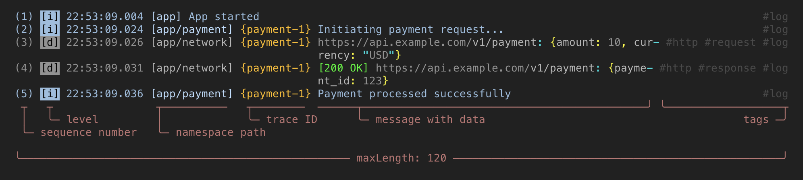

When filtering by sequence number **all lines** included in the message will be
displayed:

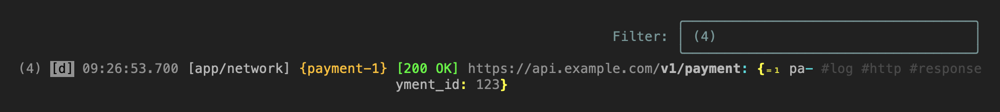

When filtering by trace ID, all messages sent within `log.trace` scope and
**all lines** within those messages will be displayed:

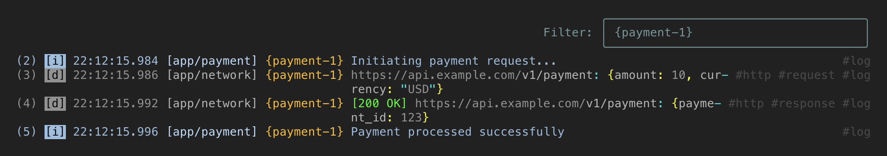

When filtering by tag, all messages with tag `#http` and
**all lines** within those messages will be displayed:

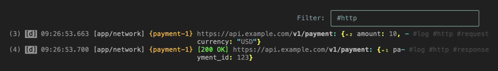

---

## Deep Dive

### 1. Message Layout

Configuring log output layout is done through the `rows` parameter in the
`ConsoleLogPrinter`. This parameter accepts a list of `LogRow` instances.

`LogRow` consists of two optional lists: `children` and `tail`.
- `children`: Elements that make up the main body of the log message.
- `tail`: Elements that are appended to the main body, typically used for tags.

Both `children` and `tail` accept a list of `LogElement` instances.
`LogElement` is a class that represents a single log element, such as
a sequence number, log level name, timestamp, trace ID, path, or message.

```dart
import 'package:team_logger/team_logger.dart';

final log = Logger('app')
  ..level = LogLevels.all
  ..publisher = ConsoleLogPrinter(
    rows: const [
      LogRow(
        maxLength: 100,
        children: [
          LogNum(),
          LogLevelName.short(),
          LogTime.onlyTime(),
          LogPath(),
          LogTraceId(),
          LogMessage(),
        ],
        tail: [
          LogTags(),
        ],
      ),
    ],
  );

log.d(
  'User info',
  traceId: TraceId.auto('user'),
  data: {
    'firstName': 'Alex',
    'lastName': 'Brown',
    'age': 30,
    'sex': 'male',
    'children': [
      {'name': 'Mary', 'age': 5},
      {'name': 'Bob', 'age': 2},
    ],
  },
);
```

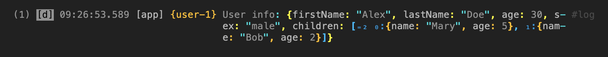

The `LogElement` class has several subclasses that can be used to represent
different log elements:
- `LogNum()`: Sequence number of the log message.
- `LogLevelName.full()`: Full name of the log level.
- `LogLevelName.short()`: Short name of the log level.
- `LogTime.dateTime()`: Date and time of the log message.
- `LogTime.iso8601()`: Date and time of the log message in ISO 8601 format.
- `LogTime.onlyTime()`: Time of the log message.
- `LogPath()`: Path of the log message.
- `LogTraceId()`: Trace ID of the log message.
- `LogMessage()`: Message of the log message.
- `LogTags()`: Tags of the log message.

The `maxLength` parameter limits the width of the log message. If the log
message exceeds the `maxLength`, it will be wrapped to the next line.

`LogMessage` takes up all the remaining space in the line. If you need to place
something to the right of `LogMessage`, use the `tail` parameter (as is done
for `LogTags`).

#### Single line

The message can be displayed as a single line (it will be wrapped by the
terminal):

```dart
final log = Logger('app')
  ..level = LogLevels.all
  ..publisher = ConsoleLogPrinter(
    rows: const [
      LogRow.singleLine(
        children: [
          // ...
        ],
      ),
    ],
  );
```

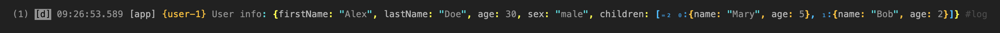

A single-line log is harder to analyze visually, but its advantage is that it
takes up only one line in your IDE’s console buffer. This is important when the
buffer has a line limit (10,000 for VSCode/Antigravity) and there are a lot of
logs. Such lines are also easier to filter: when filtering, the IDE will show
you only those lines containing the text you're looking for, rather than the
entire message if it spans multiple lines.

#### Filter logs

`team_logger` makes it a little easier to search for and filter messages by
duplicating key message information in each line, but it hides this information
so it doesn't interfere with log analysis:

```dart
final theme = LogMainTheme.defaultActiveTheme.copyWith(
  hiddenStyle: ansi.rgb050,
);
```

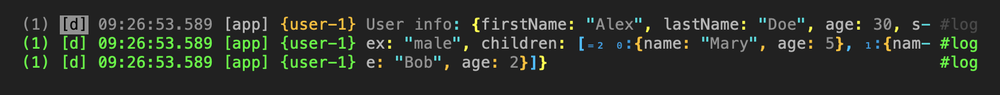

This way, you'll always be able to filter by sequence number, level, time,
namespace path, trace ID, and tags.

When filtering by message content or data, you still won’t see the full
message. But in this case, once you’ve found the log you’re looking for, you
can always filter by its sequence number. Just remember that even if you can’t
see the sequence number, it’s still there. Highlight it with your mouse and
copy it to the clipboard, and paste it into the filter field.

Some IDEs do not support the ANSI hidden style (Android Studio). In that case,
you may need to adjust the `hiddenStyle` foreground color so that it matches
the background of your IDE's debug console.

#### Why do we need rows?

When a log entry contains a stack trace, by default it is displayed within the
`LogMessage`, directly below the message itself, strictly within the space
allocated for the message:

```dart
void someOperation() {
  try {
    calcResult();
  } on Object catch (error, stackTrace) {
    log.d('Operation failed', error: error, stackTrace: stackTrace);
  }
}

int calcResult() {
  return 1 ~/ 0;
}

// ...

someOperation();
```

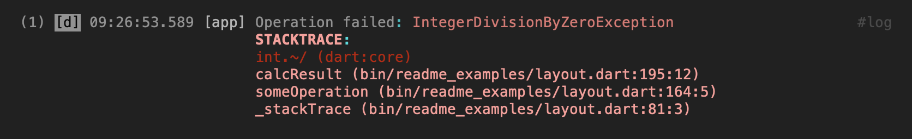

And you may need more space for the stack trace. In that case, it’s best to
move it to a separate row:

```dart
final log = Logger('app')
  ..level = LogLevels.all
  ..publisher = ConsoleLogPrinter(
    rows: [
      const LogRow(
        maxLength: 100,
        children: [
          LogNum(),
          LogLevelName.short(),
          LogTime.onlyTime(),
          LogPath(),
          LogTraceId(),
          LogMessage(showStackTrace: false), // remove stack trace from message
        ],
        tail: [LogTags()],
      ),
      LogRow(
        when: (log) => log.stackTrace != null,
        maxLength: 100,
        children: [
          // We remove any unnecessary information, keeping only the sequence
          // number, but visually hiding it (by default, the first line is
          // visible).
          LogNum(hidden: true),
          LogStackTrace(),
        ],
        // We'll keep the tags, but hide them.
        tail: [LogTags(hidden: true)],
      ),
    ],
  );
```

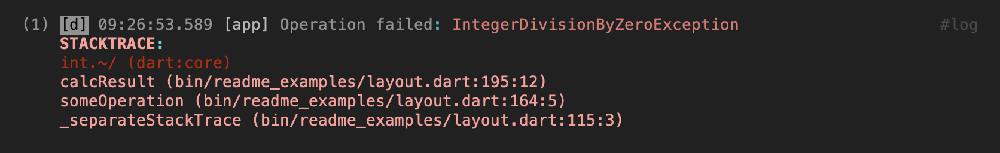

#### LogConstraints

Size constraints can be set for all elements:

```dart
final log = Logger('app')
  ..level = LogLevels.all
  ..publisher = ConsoleLogPrinter(
    rows: [
      LogRow(
        maxLength: 100,
        children: [
          LogNum(
            // Reserving space for numbering
            constraints: LogConstraints(min: 7),
            // Align to the right
            textAlign: LogTextAlign.right,
          ),
          LogLevelName.short(),
          LogTime.onlyTime(),
          LogPath(
            // We make the space for the namespace path expand as new data is
            // added, but we do not limit its growth
            constraints: LogConstraints.growable(max: 20),
          ),
          LogTraceId(),
          LogMessage(),
        ],
        tail: [LogTags()],
      ),
    ],
  );
```

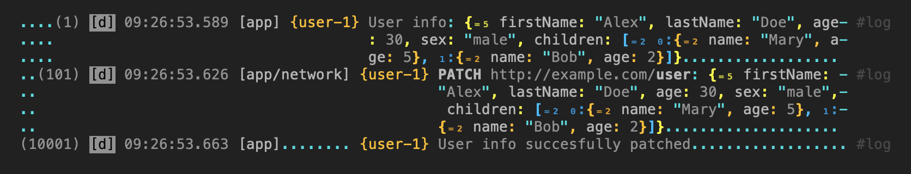

### 2. Colors & Dynamic Themes

`team_logger` supports color-coded and structured console output using
the [ansi_escape_codes](https://pub.dev/packages/ansi_escape_codes) package.

#### Color Themes & Palettes

You can use the default theme:

```dart
final theme = LogMainTheme.defaultActiveTheme;
final log = Logger('app')
    ..level = LogLevels.all
    ..publisher = ConsoleLogPrinter(
      theme: theme,
      // ...
    );
```

Or customize it to your liking using pre-made color palettes:

* **Grayscale Palettes**: `LogThemeData.gray5` to `LogThemeData.gray20`,
  providing gray tones to match dark or light terminal backgrounds.
* **RGB Palettes**: Color configurations named after their RGB values, such as
  `rgb411` (red for errors), `rgb431` (gold for warnings), and `rgb234` (blue
  for info logs).

```dart
final theme = LogMainTheme.defaultActiveTheme.copyWith(
  info: LogThemeData.rgb122,
);
```

Or create your own palette:

```dart
final theme = LogMainTheme.defaultActiveTheme.copyWith(
  info: LogThemeData.seed(
    normal: ansi.rgb030,
    emphasis: ansi.rgb252,
    dim: ansi.rgb020,
    punctuation: ansi.rgb550,
    // ...
  ),
);
```

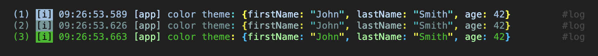

#### Dynamic Depth Color Shifting (`LogDepthTheme`)

To improve readability of nested collections (maps, lists, or custom objects),
`team_logger` supports depth-based color configurations. By specifying a list
of `LogDepthTheme` configs, brackets, punctuation and description colors shift
dynamically based on their nesting level:

```dart
final theme = LogMainTheme.defaultActiveTheme.copyWith(
  info: LogThemeData.seed(
    // ...
    depthThemes: [
      LogDepthTheme.yellow,
      LogDepthTheme.orange,
      LogDepthTheme.magenta,
      LogDepthTheme.red,
    ],
  ),
);
```

Or:

```dart
final theme = LogMainTheme.defaultActiveTheme.copyWith(
  info: LogThemeData.seed(
    // ...
    depthThemes: [
      LogDepthTheme(
        brackets: ansi.gray20,
        punctuation: ansi.gray20,
        description: ansi.gray20,
      ),
      LogDepthTheme(
        brackets: ansi.gray16,
        punctuation: ansi.gray16,
        description: ansi.gray16,
      ),
      LogDepthTheme(
        brackets: ansi.gray12,
        punctuation: ansi.gray12,
        description: ansi.gray12,
      ),
      LogDepthTheme(
        brackets: ansi.gray8,
        punctuation: ansi.gray8,
        description: ansi.gray8,
      ),
    ],
  ),
);
```

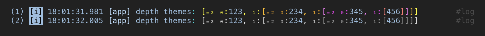

#### No Colors

To remove ANSI escape codes, use `LogMainTheme.noColors`:

```dart
final noColorsTheme = LogMainTheme.noColors;
log = Logger('app')
    ..level = LogLevels.all
    ..publisher = ConsoleLogPrinter(
      theme: LogMainTheme.noColors,
      // ...
    );
```

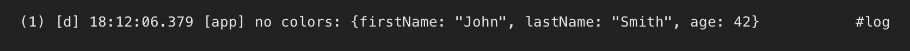

---

### 3. Active vs. Inactive Modes

To keep console output clean without losing execution context, `team_logger`
supports Active and Inactive styling modes:

* **Active Theme** (`theme`): Applied to logs that match active namespaces,
  level thresholds, active trace groups, or tags.
* **Inactive Theme** (`inactiveTheme`): Applied to other logs. These logs are
  printed using lower-contrast colors, keeping background context visible
  without cluttering the output of high-priority events.

If `inactiveTheme` is added, all logs are automatically set to inactive:

```dart
final log = Logger('app')
  ..level = LogLevels.all
  ..publisher = ConsoleLogPrinter(
    theme: LogMainTheme.defaultActiveTheme,
    inactiveTheme: LogMainTheme.defaultInactiveTheme, // Pre-configured dimmed theme
    rows: const [
      LogRow(
        maxLength: 100,
        children: [
          LogNum(),
          LogLevelName.short(),
          LogTime.onlyTime(),
          LogPath(),
          LogTraceId(),
          LogMessage(),
        ],
        tail: [LogTags()],
      ),
    ],
  );
```

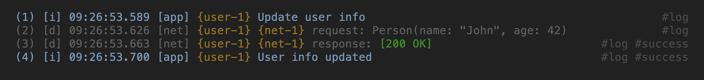

#### Activate By Level

Logs can be activated based on various criteria. For example, based on
a minimum level:

```dart
final log = Logger('app')
  ..level = LogLevels.all
  ..publisher = ConsoleLogPrinter(
    theme: LogMainTheme.defaultActiveTheme,
    inactiveTheme: LogMainTheme.defaultInactiveTheme,
    activeMinLevel: LogLevels.info,
    // ...
  );
```

Or based on any levels:

```dart
final log = Logger('app')
  ..level = LogLevels.all
  ..publisher = ConsoleLogPrinter(
    theme: LogMainTheme.defaultActiveTheme,
    inactiveTheme: LogMainTheme.defaultInactiveTheme,
    activeLevels: {LogLevels.info, LogLevels.warning, LogLevels.error, LogLevels.critical},
    // ...
  );
```


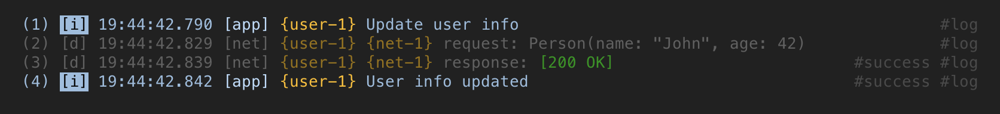

#### Activate By Namespace

```dart
final log = Logger('app')
  ..level = LogLevels.all
  ..publisher = ConsoleLogPrinter(
    theme: LogMainTheme.defaultActiveTheme,
    inactiveTheme: LogMainTheme.defaultInactiveTheme,
    activeNamespaces: {'net'},
    // ...
  );
```

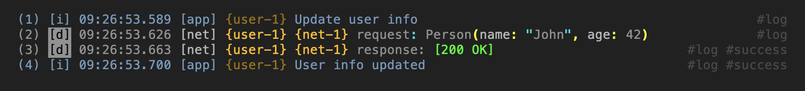

#### Activate By Trace IDs

```dart
final log = Logger('app')
  ..level = LogLevels.all
  ..publisher = ConsoleLogPrinter(
    theme: LogMainTheme.defaultActiveTheme,
    inactiveTheme: LogMainTheme.defaultInactiveTheme,
    activeTraceGroups: {'user', 'net'},
    // ...
  );
```

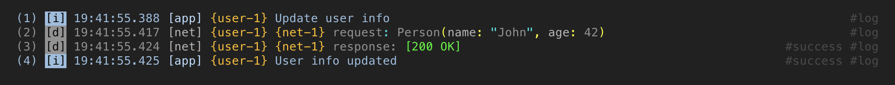

#### Activate By Tags

```dart
final log = Logger('app')
  ..level = LogLevels.all
  ..publisher = ConsoleLogPrinter(
    theme: LogMainTheme.defaultActiveTheme,
    inactiveTheme: LogMainTheme.defaultInactiveTheme,
    activeTags: {'success'},
    // ...
  );
```

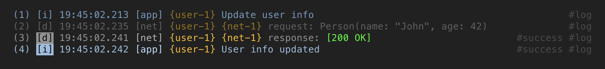

#### Activate By Callback

```dart
final log = Logger('app')
  ..level = LogLevels.all
  ..publisher = ConsoleLogPrinter(
    theme: LogMainTheme.defaultActiveTheme,
    inactiveTheme: LogMainTheme.defaultInactiveTheme,
    isLogActive: (log) => log.hasData,
    // ...
  );
```

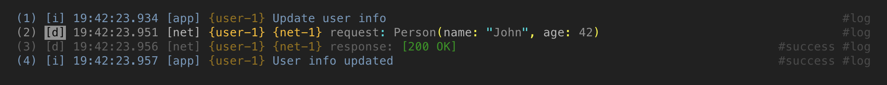

#### How can this be used?

Activation or deactivation logs is only useful when each developer uses them
individually, to temporarily filter out other's logs and focus on their own.

But `team_logger` does not support dynamic activation or deactivation of logs.
All activation conditions must be specified at the time the root logger is
created. This raises a valid question: how, then, can this be applied to large
teams?

**Answer:** By using a custom environment. Here's how you can do it:

##### a) create a class for the developer's personal environment settings:

```dart
final MyDevEnvironment myDevEnvironment = MyDevEnvironment._();

// Developer Environment Settings.
final class MyDevEnvironment {
  MyDevEnvironment._();

  bool logSingleLine = false;
  int logLength = 120;
  int? logMaxLines;
  bool logAlwaysIsActive = false;
  bool Function(Log log)? logIsActive;
  int logActiveMinLevel = LogLevels.off;
  Set<int> logActiveLevels = <int>{};
  Set<String> logActiveNamespaces = <String>{};
  Set<String> logActiveTraceGroups = <String>{};
  Set<String> logActiveTags = <String>{};
}
  ```

##### b) create `main_dev.dart`:

```dart
import 'main.dart' as production;

void main() {
  myDevEnvironment
    ..logLength = 130
    ..logMaxLines = 20
    ..logActiveNamespaces = {'app', 'network'}
    ..logActiveTraceGroups = {'events'};

  production.main();
}
```

##### c) Configure your IDE to run `main_dev.dart` instead of `main.dart`:

VSCode/Antigravity example:

```json
// .vscode/launch.json
{
    // ...
    "configurations": [
        {
            "name": "My awesome program",
            "request": "launch",
            "type": "dart",
            "program": "lib/main_dev.dart",
            // ...
        },
        // ...
    ]
}
```

But let your CI/CD continue to use `main.dart`.

##### d) add `main_dev.dart` to `.gitignore`:

`main_dev.dart` should remain a personal file for each developer, so it should
not be added to your version control system.

Now each developer will need to create their own version of `main_dev.dart`
with their own settings.

Or, you can automate this process:

##### e) create the `main_dev.template.dart` template for `main_dev.dart`:

```dart
// template: Do not change this file directly. This file is used as a template to generate `main_dev.dart`

import 'main.dart' as production;

void main() {
  myDevEnvironment
    ..logLength = 120
    ..logMaxLines = 20
    ..logActiveNamespaces = {'app', 'network'}
    ..logActiveTraceGroups = {'events'};

  production.main();
}
```

##### f) create `preLaunchTask`:

```json
// .vscode/launch.json
{
    // ...
    "configurations": [
        {
            "name": "My awesome program",
            "preLaunchTask": "initDevEnvironment",
            // ...
        },
        // ...
    ]
}

// .vscode/tasks.json
{
    // ...
    "tasks": [
        {
            "label": "initDevEnvironment",
            "type": "shell",
            "command": "[[ -e lib/main_dev.dart ]] || cp lib/main_dev.template.dart lib/main_dev.dart && sed -i '' '/^\\/\\/ template:/d' lib/main_dev.dart",
            "presentation": {
                "echo": true,
                "reveal": "silent",
                "focus": false,
                "panel": "shared",
                "showReuseMessage": true,
                "clear": false
            }
        },
        // ...
    ]
}
```

This task will run before each application build and create `main_dev.dart` if
necessary.

---

### 4. BBCode Tags

`LogMainTheme` has a `messageFormatter` parameter for formatting messages. By
default, it is set to `BbCodeFormatter`.

#### Default tags

The `BbCodeFormatter` parses BBCode tags in log messages to apply styles
defined in the theme:

```dart
log.d('This is a [b]bold[/b] text');
log.d('This is a [success]success[/success] text');
log.d('This is a [warning]warning[/warning] text within the not-warning text');
log.d('This is a [error]error[/error] text within the not-error text');
log.d('This is a [signal]signal[/signal] to get attention');
```

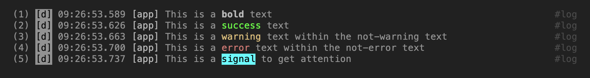

#### User tags

You can add your own tags:

```dart
final theme = LogMainTheme.defaultActiveTheme.copyWith(
  messageStyles: {
    'b': LogStyle(ansi.bold),
    'i': LogStyle(ansi.italic),
    's': LogStyle(ansi.strikethrough),
    'u': LogStyle(ansi.underline),
  },
);

log.d('This is a [b]bold[/b] text', theme: theme);
log.d('This is a [i]italic[/i] text', theme: theme);
log.d('This is a [s]strikethrough[/s] text', theme: theme);
log.d('This is a [u]underline[/u] text', theme: theme);
```

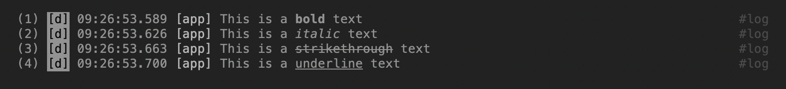

#### Lazy Style

If the style depends on the current theme settings, use `LogLazyStyle`:

```dart
final theme = LogMainTheme.defaultActiveTheme.copyWith(
  messageStyles: {
    'fatal': LogLazyStyle((theme) => theme.main.critical.data.normal),
  },
);

log.d('This is [fatal]a fatal error[/fatal]');
```

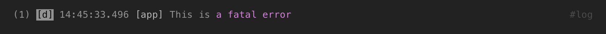

#### No Colors

When switching to the `LogMainTheme.noColors` theme, the tags will remain in
the message text; since this theme does not include message styles:

```dart
final theme = LogMainTheme.noColors;
```

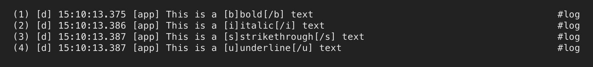

If you need to remove the tags, add them to messageStyles:

```dart
final theme = LogMainTheme.noColors.copyWith(
  messageStyles: const {
    'b': LogNoStyle(),
    'i': LogNoStyle(),
    's': LogNoStyle(),
    'u': LogNoStyle(),
  },
);
```

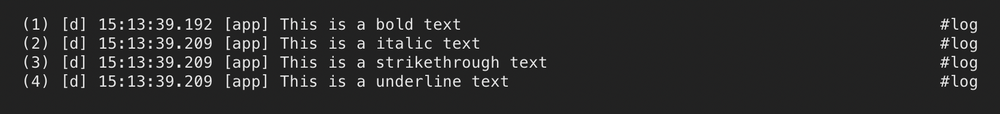

There is a pre-made theme for default tags: `LogMainTheme.noColorsNoTags`.

```dart
final theme = LogMainTheme.noColorsNoTags;
```

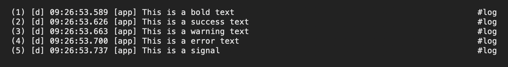

---

### 5. Data Output

#### Data Parameter

Typically, the output of data logging looks something like this:

```dart
const person = {'firstName': 'John', 'lastName': 'Smith', 'age': 42};
log.d('Person: $person');
```

`team_logger` offers a different approach to data logging:

```dart
log.d('Person', data: person);
```

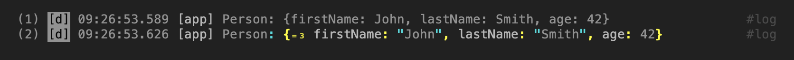

This will not only allow you to display a more readable message in the console,
formatted using ANSI escape codes, but also make it easier to log the data to
a database or analytics system.

#### Deeply Nested Objects

The color of the brackets changes dynamically depending on the nesting level
to make nested structures easier to understand:

```dart
log.d(
  'deeply nested',
  data: {
    'deeply': {
      'nested': {'object': person},
    },
  },
);
```

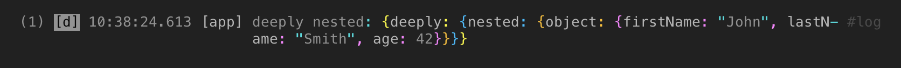

#### Multi Data

The data can be divided into sections:

```data
log.d(
  'Add new user',
  data: LoggableMultiData({
    'HEADERS': {'Content-Type': 'application/json'},
    'BODY': person,
  }),
);
```

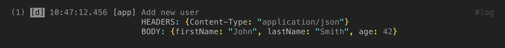

#### Collection Truncation & Formatting

Large lists or maps can be truncated dynamically to show only the boundaries
(first and last elements) using `LoggableConfig`:

```dart
log.d(
  'List',
  data: [1.2, 2.3, 3.4, 4.5, 5.6],
  config: const LoggableConfig(
    collectionMaxCount: 3,
    collectionShowCount: true,
    collectionShowIndexes: true,
  ),
);

log.d(
  'Set',
  data: {1.2, 2.3, 3.4, 4.5, 5.6},
  config: const LoggableConfig(collectionMaxCount: 3),
);

log.d(
  'Iterable',
  data: [1.2, 2.3, 3.4, 4.5, 5.6].where((e) => true),
  config: const LoggableConfig(collectionMaxCount: 3),
);
```

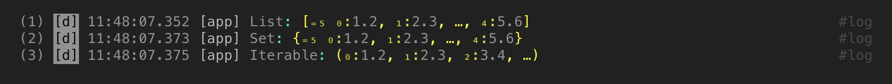

#### Formatting Settings

You can use dot shorthand syntax for enums (default):

```dart
log.d(
  'Enum',
  data: MyEnum.value1,
  config: LoggableConfig(enumDotShorthand: true),
);
log.d(
  'Enum',
  data: MyEnum.value2,
  config: LoggableConfig(enumDotShorthand: false),
);
```

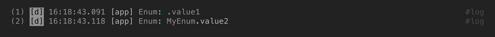

Numbers can be formatted in the
[format](https://docs.python.org/3/library/string.html#format-string-syntax)/[sprintf](https://en.cppreference.com/w/c/io/fprintf)
style (using the [format](https://pub.dev/packages/format) package):

```dart
log.d(
  'Float number with fixed precision',
  data: 1.23456789,
  config: const LoggableConfig(doubleFormat: '.4f'),
);

log.d(
  'Integer number with grouping',
  data: 123456789,
  config: const LoggableConfig(intFormat: ',d'),
);

Intl.defaultLocale = 'bn';
log.d(
  'Integer number (Bengali locale)',
  data: 123456789,
  config: const LoggableConfig(intFormat: ',n'),
);
```

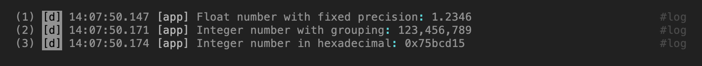

String can be displayed with or without quotation marks:

```dart
log.d(
  'String',
  data: 'abc',
  config: const LoggableConfig(stringInQuotes: true),
);
log.d(
  'String',
  data: 'abc',
  config: const LoggableConfig(stringInQuotes: false),
);
```

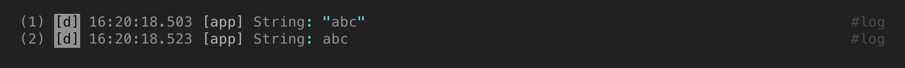

---

### 6. Formatting Complex Objects

#### `Loggable` Mixin

Implementing the `Loggable` mixin on your data models allows you to format
objects with specific controls for property visibility, units, floating-point
precision, and display format.

The usual way:

```dart
final class Person {
  final String name;
  final int age;

  const Person(this.name, this.age);

  @override
  String toString() => 'Person(name: $name, age: $age)';
}

log.d('Person (usual)', data: Person('John', 42));
```

The `team_logger` way:

```dart
final class Person with Loggable {
  final String name;
  final int age;

  const Person(this.name, this.age);

  @override
  void collectLoggableData(LoggableData data) {
    data
      ..prop('name', name)
      ..prop('age', age);
  }
}

log.d('Person (Loggable)', data: Person('John', 42));
```

Use together in [freezed](https://pub.dev/packages/freezed):

```dart
@freezed
abstract class Person with _$Person, Loggable {
  const Person._(); // define a private empty constructor

  const factory Person(String name, int age) = _Person;

  @override
  void collectLoggableData(LoggableData data) {
    data
      ..name = 'Person' // change the name, otherwise _Person will be used as the name
      ..prop('name', name)
      ..prop('age', age);
  }
}

log.d('Person (freezed)', data: Person('John', 42));
```

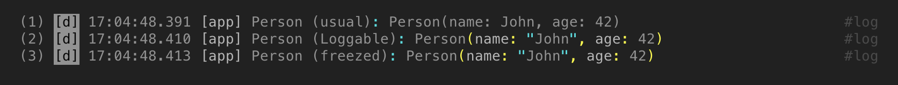

#### Property Configuration

Standard full view:

```dart
final class Point with Loggable {
  final double lat;
  final double lon;

  const Point(this.lat, this.lon);

  @override
  void collectLoggableData(LoggableData data) {
    data
      ..round('lat', lat, precision: 5)
      ..round('lon', lon, precision: 5);
  }
}

final class Speed with Loggable {
  final double value;
  final double accuracy;

  const Speed(this.value, this.accuracy);

  @override
  void collectLoggableData(LoggableData data) {
    data
      ..prop('value', value)
      ..prop('accuracy', accuracy);
  }
}


log.d('Point (full)', data: Point(51.894167, 1.482222));
log.d('Speed (full)', data: Speed(143, 2.5));
```

Short view:

```dart
final class Point with Loggable {
  // ...

  @override
  void collectLoggableData(LoggableData data) {
    data
      ..showName = false
      ..round('lat', lat, precision: 5, showName: false, units: '°')
      ..round('lon', lon, precision: 5, showName: false, units: '°');
  }
}

final class Speed with Loggable {
  // ...

  @override
  void collectLoggableData(LoggableData data) {
    data
      ..showName = false
      ..showBrackets = false
      ..prop(
        'value',
        value,
        showName: false,
        view: '${value.toStringAsFixed(1)}±${accuracy.toStringAsFixed(1)}',
        units: 'm/s',
      )
      ..prop('accuracy', accuracy, hidden: true); // for GUI
  }
}

log.d('Point (short)', data: Point(51.894167, 1.482222));
log.d('Speed (short)', data: Speed(143, 2.5));
```

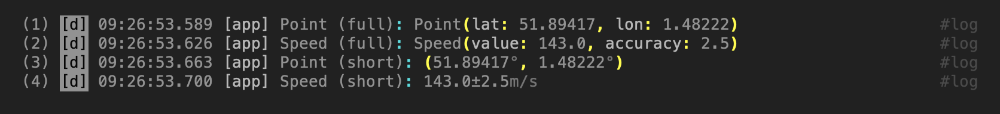

#### Multi View

```dart
final class RouteInfo with Loggable {
  final Duration duration;
  final double distance;

  const RouteInfo({
    required this.duration,
    required this.distance,
  });

  @override
  void collectLoggableData(LoggableData data) {
    data
      ..prop(
        'duration',
        duration,
        view: LoggableMultiView([
          LoggableView(duration),
          LoggableView(duration.inMinutes, units: 'min'),
        ]),
      )
      ..prop(
        'distance',
        distance,
        view: LoggableMultiView([
          LoggableView(distance.toStringAsFixed(1), units: 'km'),
          LoggableView((distance / 1.852).toStringAsFixed(1), units: 'NM'),
        ]),
      );
  }
}

final routeInfo = RouteInfo(
  duration: Duration(minutes: 90),
  distance: 124,
);

log.d('Route info', data: routeInfo);
```

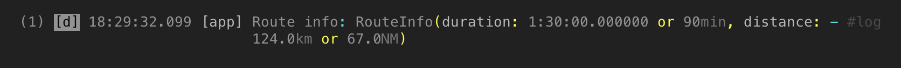

#### Map and Builder Helpers

For quick property collection or third-party objects, use `Loggable.mapBuilder`
or `Loggable.builder`:

```dart
final class NotLoggableObject {
  final double weight;
  final double height;

  NotLoggableObject(this.weight, this.height);
}

final notLoggableObject = NotLoggableObject(85.5, 1.80);

log.d(
  'Quick Info',
  data: Loggable.mapBuilder()
    ..prop('weight', notLoggableObject.weight, units: 'kg')
    ..prop('height', notLoggableObject.height, units: 'm'),
);

log.d(
  'Quick Info',
  data: Loggable.builder(notLoggableObject)
    ..prop('weight', notLoggableObject.weight, units: 'kg')
    ..prop('height', notLoggableObject.height, units: 'm'),
);
```

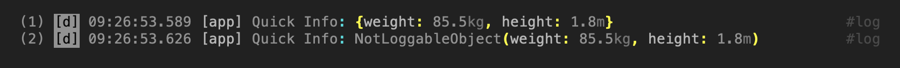

---

#### Custom Type Converters

To format third-party classes that cannot implement the `Loggable` mixin
directly, register a `LoggableTypeConverter`:

```dart
class MyConverter implements LoggableTypeConverter<NotLoggableObject> {
  @override
  LoggableData convertToData(NotLoggableObject obj) => Loggable.builder(obj)
    ..prop('weight', obj.weight, units: 'kg')
    ..prop('height', obj.height, units: 'm');
}

final notLoggableObject = NotLoggableObject(85.5, 1.80);
log.d('NotLoggableObject (toString)', data: notLoggableObject);

Loggable.registerTypeConverter(MyConverter());
log.d('NotLoggableObject (MyConverter)', data: notLoggableObject);
```

The converter is looked up strictly by the object's `runtimeType`:
subclasses of the registered type are not converted.

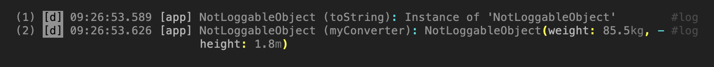

### 7. Trace Propagation (`TraceId`)

#### Zone-Based Trace Propagation

Instead of passing correlation IDs manually through nested function calls,
`team_logger` uses **Dart Zones** to associate a `TraceId` with all synchronous
and asynchronous operations inside the execution context:

```dart
final searchTrace = TraceId.auto('search'); // resolves to '#search-1'

await log.trace(searchTrace, () async {
  log.d('Searching database...');    // captures and outputs '#search-1'
  await Future.delayed(Duration(milliseconds: 100));
  log.i('Database fetch completed'); // captures and outputs '#search-1'
});
```

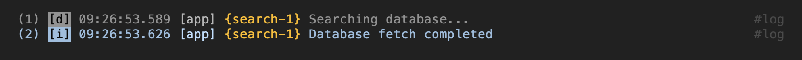

#### `TraceId` configurations

Supported `TraceId` configurations:
* `TraceId.auto(group)`: Automatically incremented IDs scoped to a specific
  group name.
* `TraceId.global()`: Automatically incremented sequential IDs without a group
  prefix: `{1}`, `{2}`...
* `TraceId.manual(group, num)`: Pre-defined IDs, useful when matching external transaction identifiers.

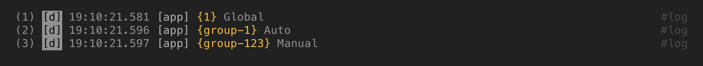

#### `TraceId` suffix

A suffix can be added to any TraceID:

```dart
Future<Response> request(Uri uri) async {
  final traceId = TraceId.auto('request');

  log.i('$uri', traceId: traceId);
  // ... request ...

  // If request failed, retry:
  for (var i = 0; i < 3; i++) {
    log.w('$uri. Attempt #${i + 2}', traceId: traceId.withSuffix('${i + 2}'));
    // ... retry ...
  }
}
```

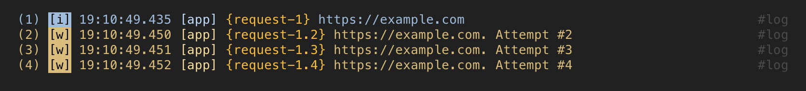

#### `TraceId` laziness

`TraceId.auto` and `TraceId.global` use lazy increment. In other words, the
number is incremented only when `TraceId` is actually used:

```dart
log.level = LogLevels.all;

log.d('Debug message', traceId: TraceId.auto('lazy'));   // lazy-1
log.i('Info message', traceId: TraceId.auto('lazy'));    // lazy-2
log.w('Warning message', traceId: TraceId.auto('lazy')); // lazy-3

log.level = LogLevels.warning;

log.d('Debug message', traceId: TraceId.auto('lazy'));   // not displayed
log.i('Info message', traceId: TraceId.auto('lazy'));    // not displayed
log.w('Warning message', traceId: TraceId.auto('lazy')); // lazy-4
```

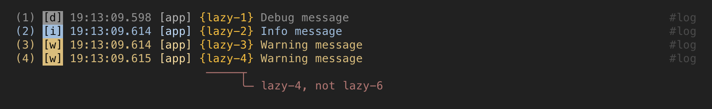

---

### 8. Circular Buffer (`LogStorage`)

`LogStorage` retains a fixed count of logs in memory. This is designed for
capturing diagnostic snapshots, telemetry display in debug screens, or passing
logs to local storage.

```dart
final logStorage = LogStorage(maxCount: 1000);

// Attach to the logger publisher
log.publisher = MultiPublisher([
  ConsoleLogPrinter(rows: [...]),
  logStorage,
]);

// Retrieve the in-memory log history
List<Log> history = logStorage.snapshot();
```

See also [flutter_team_logger](https://pub.dev/packages/flutter_team_logger),
which uses `LogStorage`.

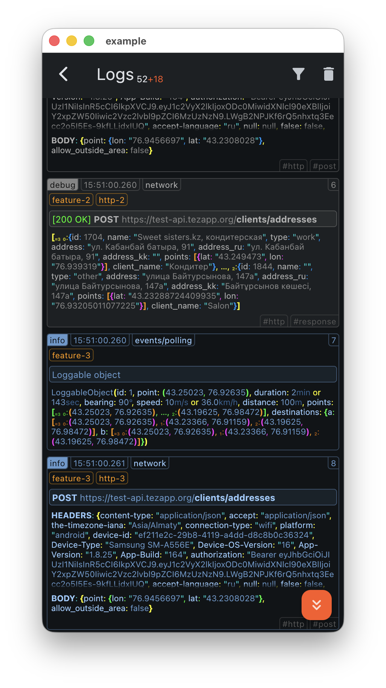

---

### 9. Saving Logs to Files (`FileLogStorage`)

`FileLogStorage` stores logs on the user's device so they can later be sent
for diagnostics. It lives in a separate library built on `dart:io` — import
`package:team_logger/team_logger_io.dart` instead of `team_logger.dart`
(it re-exports the whole core API). On the web, keep using the core library.

Every application run gets its own **session**. A session is a chain of chunk
files `<sessionId>.<index>.jsonl` written as JSON Lines, one JSON object per
log. The first line of every chunk is a metadata line (`":meta"` key) with
the session id, start time and any fields you pass in `meta`.

```dart
final storage = FileLogStorage(
  directory: '/path/to/logs',            // e.g. from path_provider
  meta: {'appVersion': '1.2.3'},         // written into the meta line
  maxSessionSize: 10 * 1024 * 1024,      // per-session limit (chunk rotation)
  maxChunkSize: 1024 * 1024,             // per-chunk limit
  maxTotalSize: 100 * 1024 * 1024,       // limit for all sessions together
  maxAge: const Duration(days: 7),       // sessions older than this are deleted
);

log.publisher = MultiPublisher([
  ConsoleLogPrinter(rows: [...]),
  storage,
]);
```

Three size limits, from the outside in (the number of sessions and chunks
is never limited — only sizes are):

- **All sessions** (`maxTotalSize`, `maxAge`): on startup, sessions older
  than `maxAge` are deleted, then the oldest sessions are removed until the
  rest fit into `maxTotalSize` (minus a `maxSessionSize` reserve for the
  current session).
- **Per session** (`maxSessionSize`): when the session's total exceeds the
  limit, the oldest chunk is deleted — the most recent logs are always kept.
- **Per chunk** (`maxChunkSize`): when a chunk file reaches the limit, the
  next chunk is started. Must fit into `maxSessionSize` at least twice.

The `data` parameter of a log is saved as text by
`Loggable.objectToString` (default) or as structured JSON by
`Loggable.objectToJson`:

```dart
FileLogStorage(
  directory: '...',
  dataFormat: FileLogDataFormat.json,    // objectToJson
);

FileLogStorage(
  directory: '...',
  // dataFormat: FileLogDataFormat.text is the default (objectToString).
  // The theme controls formatting; ANSI codes are preserved in the file,
  // LogMainTheme.noColors (the default) produces clean text.
  theme: LogMainTheme.defaultActiveTheme,
);
```

To send logs for diagnostics, list the stored sessions and pack them into
a single ZIP archive (each session stays a separate file inside), or export
them as plain files:

```dart
await storage.flush();                   // make sure everything is on disk

final sessions = await storage.sessions.list();
await storage.sessions.archiveTo(File('/tmp/logs.zip'));          // one zip
await storage.sessions.exportTo(Directory('/tmp/logs'));          // plain files

// Inspect or clean up:
for (final session in sessions) {
  print('${session.id}: ${session.size} bytes, ${session.lastModified}');
  print(await session.readMeta());       // {'sessionId': ..., 'appVersion': ...}
}
```

---

### 10. Redacting Logs (`Logger.transformer`)

Assign `Logger.transformer` to mask secrets/PII, or drop disallowed logs
entirely, right before publishing — it is inherited by child loggers just
like `level`/`publisher`, and returning `null` drops the log. Build it with
`Log.copyWith`, which always preserves the log's identity (its number and
time); a throwing transformer is fail-closed — the log is dropped and the
unmasked version is never published.

```dart
log.transformer = (entry) => entry.copyWith(
  message: entry.message.replaceAll(RegExp(r'\d{16}'), '**** **** **** ****'),
);
```

To mask a single destination instead, wrap it in `TransformPublisher` inside
a `MultiPublisher` — other publishers keep receiving the log untouched:

```dart
log.publisher = MultiPublisher([
  ConsoleLogPrinter(rows: [...]),                       // stays verbatim
  TransformPublisher(fileStorage, transformer: redact), // masked before writing
]);
```

#### Per-Value Sanitization (`Loggable.sanitizer`)

`Logger.transformer` replaces the log as a whole. To redact values
**inside** `data` — including values nested in objects, maps and
collections — assign a global sanitizer instead: it is called for every
value on its way to the output, so no publisher can miss it (console,
file storage, session export, an in-app log viewer — all of them go
through the same rendering code).

```dart
Loggable.sanitizer = (ctx) => switch (ctx.name) {
  'password' || 'token' => Sanitize.drop,      // the property disappears
  'pan' => '**** **** **** ${(ctx.value! as String).substring(12)}',
  _ => ctx.value,
};

log.i(
  'checkout',
  data: {
    'user': 'ann',
    'token': 'abc123',
    'card': {'pan': '4111111111111234'},
  },
);
// checkout: {user: "ann", card: {pan: "**** **** **** 1234"}}
```

`ctx` (a `SanitizeContext`) also carries `path` (`user.card.pan`) and
`depth`. Returning a replacement stops the *original*'s children from
being offered to the rule, but the replacement is rendered normally — its
own children are offered to the rule like any other value. A rule whose
replacement itself matches the same rule recurses forever.

A few things worth knowing before writing a rule:

- The rule must be a pure function with no side effects, and it must not
  render or log from inside itself — not even implicitly, via
  `toString()`/string interpolation of the value it was handed.
- For a property with a `view` (see "Property Configuration" above), the
  rule sees the `view` object, not the text it renders — redact such
  properties by `name`/`path`, not by matching rendered content.
- In a collection-element position, `Sanitize.drop` renders as
  `'<dropped>'` rather than removing the element, so the printed
  collection length stays honest.
- `Loggable.sanitizer` is a per-isolate static: set it again in any
  isolate you spawn.
- Sanitizing happens while rendering, so cycle protection, collection
  limits and lazy iterables are unaffected, and filtered-out logs still
  cost nothing. The raw value still lives in `Log.data` — reach for
  `Logger.transformer` when a value must not exist in memory at all.

---

## License

This library is licensed under the MIT License. See [LICENSE](file:///Users/user/development/my/team_logger/LICENSE) for details.
